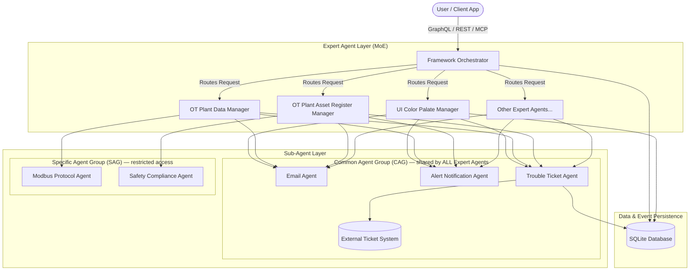
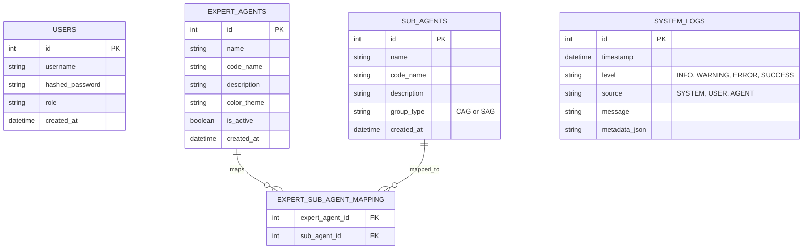
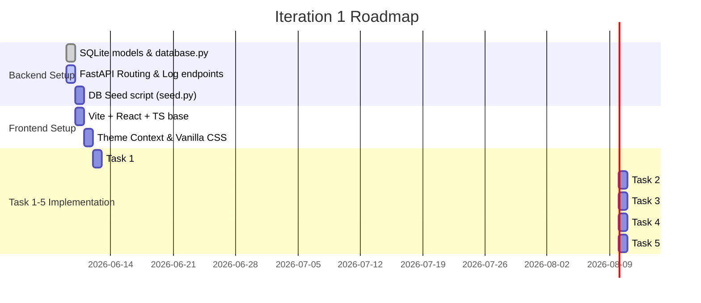

# Technical Specification: AI-Agent Application Framework (CDAGS)

This document defines the technical specifications for the **AI-Agent Application Framework**, an implementation of the **Mixture of Experts (MOE)** design pattern. It provides detailed architecture, data models, API endpoints, frontend designs, and execution protocols required to develop the system, starting with **Iteration 1**.

---

## 1. System Architecture & Design Patterns

The AI-Agent Application Framework orchestrates a set of specialized **Expert AI Agents** and **Sub-Agents** to solve complex domain-specific tasks.



> **Note on CAG vs SAG routing:** The Common Agent Group (CAG) is a shared pool — every Expert Agent can invoke any CAG sub-agent. The diagram above reflects this by drawing all CAG edges explicitly. By contrast, SAG sub-agents (Modbus, Safety Compliance) are restricted to the specific Expert Agents they are mapped to in the `expert_sub_agent_mapping` table.

### 1.1 The Mixture of Experts (MoE) Pattern
In this framework:
1. **Orchestrator (Router)**: Manages requests, routes them to the appropriate expert agent, and maintains the global system state.
2. **Expert Agents**: Domain-specific AI models or rule engines that have deep functional domain knowledge.
3. **Sub-Agents**: Smaller utility agents designed for specific workflows. Sub-agents are organized into two groups:
   - **Common Agent Group (CAG)**: Sub-agents accessible by *any* Expert Agent. Example capabilities: sending emails, raising alerts, creating tickets in external systems. CAG agents are **not** stored in the `expert_sub_agent_mapping` table — their availability is implicit from `group_type = "CAG"`.
   - **Specific Agent Group (SAG)**: Sub-agents restricted to one or more *explicitly authorized* Expert Agents. Authorized pairings are stored in the `expert_sub_agent_mapping` table. Example: An "OT Plant Asset Risk Register Manager" has access to an "Asset Risk Calculator Agent" that is not available to the "UI Color Palate Manager".

### 1.2 Agent Communication Protocol
Agents communicate asynchronously or synchronously using a standardized JSON payload structure.
* **Input payload**: A JSON object containing static configurations, user parameters, and upstream execution context.
* **Output payload**: A JSON object containing the execution results, state updates, and downstream execution instructions.
* **Agent-to-Agent Protocol / MCP**: The framework supports communication via the Model Context Protocol (MCP) or direct REST-like agent communication interfaces, where each agent acts as a client/server exchange.

---

## 2. Backend Technical Specification (Python & FastAPI)

The backend is written in Python (3.11+) using **FastAPI**, **SQLAlchemy** as the ORM, and **SQLite** as the database. It is managed within a Python virtual environment (`.venv`).

### 2.1 Backend Directory Structure
```
backend/
├── app/
│   ├── __init__.py
│   ├── main.py                 # FastAPI application initialization & routing
│   ├── config.py               # Configuration and environment variables
│   ├── database.py             # SQLAlchemy engine & session maker
│   ├── models/                 # SQLAlchemy models
│   │   ├── __init__.py
│   │   ├── agent.py            # Expert, Sub-Agent, and Mapping models
│   │   ├── log.py              # Logging models
│   │   └── user.py             # User authentication models
│   ├── schemas/                # Pydantic validation schemas
│   │   ├── __init__.py
│   │   ├── agent.py
│   │   ├── log.py
│   │   └── user.py
│   ├── api/                    # API Route controllers
│   │   ├── __init__.py
│   │   ├── auth.py
│   │   ├── agents.py
│   │   └── logs.py
│   └── services/               # Core business & agent execution logic
│       ├── __init__.py
│       └── agent_engine.py     # Executes CAG/SAG routing logic
├── tests/                      # Pytest test suite
│   ├── __init__.py
│   ├── test_auth.py
│   └── test_agents.py
├── seed.py                     # One-time DB seeding script for Expert & Sub-Agents
├── requirements.txt            # Dependency file
└── run.py                      # Entry point for development execution
```

### 2.2 Database Schema (SQLAlchemy Models)

The SQLite database must contain tables to manage users, expert agents, sub-agents, relationships, and logs.



> **Mapping table scope:** `EXPERT_SUB_AGENT_MAPPING` stores **SAG-only** relationships. CAG sub-agents (`group_type = "CAG"`) are implicitly accessible to all Expert Agents and are never recorded in this table. When the `agent_engine` service resolves which sub-agents an Expert Agent may call, it unions the full CAG pool with the agent's explicit SAG entries from this table.

#### database.py
```python
"""
Database connection setup and session management.
"""
import os
from sqlalchemy import create_engine
from sqlalchemy.orm import sessionmaker, DeclarativeBase

DATABASE_URL = os.getenv("DATABASE_URL", "sqlite:///./cdags_framework.db")

engine = create_engine(
    DATABASE_URL, connect_args={"check_same_thread": False}
)
SessionLocal = sessionmaker(autocommit=False, autoflush=False, bind=engine)

class Base(DeclarativeBase):
    pass

def get_db():
    """
    Dependency to yield database session and close it after the request.

    Yields:
        Session: SQLAlchemy database session.
    """
    db = SessionLocal()
    try:
        yield db
    finally:
        db.close()
```

> **SQLAlchemy 2.x compatibility:** `declarative_base()` from `sqlalchemy.ext.declarative` was deprecated in SQLAlchemy 1.4 and removed in 2.0. The project pins `SQLAlchemy==2.0.x`, so `Base` must be defined using `DeclarativeBase` from `sqlalchemy.orm` as shown above.

#### models/user.py
```python
"""
Database model for user credentials and profiles.
"""
from sqlalchemy import Column, Integer, String, DateTime
from datetime import datetime, timezone
from app.database import Base

class User(Base):
    """
    Represents a user account in the application framework.
    """
    __tablename__ = "users"

    id = Column(Integer, primary_key=True, index=True)
    username = Column(String, unique=True, index=True, nullable=False)
    hashed_password = Column(String, nullable=False)
    role = Column(String, default="user")
    created_at = Column(DateTime, default=lambda: datetime.now(timezone.utc))
```

> **`datetime.utcnow` deprecation:** `datetime.utcnow()` is deprecated since Python 3.12 and returns a naïve datetime with no timezone info. All timestamp defaults use `lambda: datetime.now(timezone.utc)` — a timezone-aware UTC datetime — throughout all models.

#### models/agent.py
```python
"""
Database models representing Expert AI Agents, Sub-agents, and SAG mappings.
"""
from sqlalchemy import Column, Integer, String, Boolean, DateTime, Table, ForeignKey
from sqlalchemy.orm import relationship
from datetime import datetime, timezone
from app.database import Base

# Association table storing SAG-only Expert↔SubAgent authorizations.
# CAG sub-agents (group_type="CAG") are NOT stored here — they are
# implicitly available to all Expert Agents.
expert_sub_agent_mapping = Table(
    "expert_sub_agent_mapping",
    Base.metadata,
    Column("expert_agent_id", Integer, ForeignKey("expert_agents.id", ondelete="CASCADE"), primary_key=True),
    Column("sub_agent_id", Integer, ForeignKey("sub_agents.id", ondelete="CASCADE"), primary_key=True)
)

class ExpertAgent(Base):
    """
    Represents an Expert level AI Agent in a particular functional domain.
    """
    __tablename__ = "expert_agents"

    id = Column(Integer, primary_key=True, index=True)
    name = Column(String, unique=True, nullable=False)
    code_name = Column(String, unique=True, nullable=False)
    description = Column(String, nullable=True)
    color_theme = Column(String, nullable=False, default="#1e293b")
    is_active = Column(Boolean, default=True)
    created_at = Column(DateTime, default=lambda: datetime.now(timezone.utc))

    # SAG sub-agents explicitly authorized for this Expert Agent only.
    # Use agent_engine.get_available_sub_agents(agent) to obtain the full
    # set including CAG agents.
    sag_sub_agents = relationship(
        "SubAgent",
        secondary=expert_sub_agent_mapping,
        back_populates="authorized_experts"
    )

class SubAgent(Base):
    """
    Represents a utility Sub-Agent (either Common CAG or Specific SAG).
    group_type determines routing scope: "CAG" = all experts, "SAG" = mapping table only.
    """
    __tablename__ = "sub_agents"

    id = Column(Integer, primary_key=True, index=True)
    name = Column(String, unique=True, nullable=False)
    code_name = Column(String, unique=True, nullable=False)
    description = Column(String, nullable=True)
    group_type = Column(String, nullable=False, default="CAG")  # "CAG" or "SAG"
    created_at = Column(DateTime, default=lambda: datetime.now(timezone.utc))

    # Expert Agents that have been explicitly authorized to use this SAG agent.
    # Empty for CAG agents (authorization is implicit).
    authorized_experts = relationship(
        "ExpertAgent",
        secondary=expert_sub_agent_mapping,
        back_populates="sag_sub_agents"
    )
```

#### models/log.py
```python
"""
Database model for recording interaction logs and system statuses.
"""
from sqlalchemy import Column, Integer, String, DateTime, Text
from datetime import datetime, timezone
from app.database import Base

class SystemLog(Base):
    """
    Represents a system event log or user interaction record.
    Valid levels: INFO, WARNING, ERROR, SUCCESS.
    Valid sources: SYSTEM, USER, AGENT.
    """
    __tablename__ = "system_logs"

    id = Column(Integer, primary_key=True, index=True)
    timestamp = Column(DateTime, default=lambda: datetime.now(timezone.utc), index=True)
    level = Column(String, default="INFO")      # INFO, WARNING, ERROR, SUCCESS
    source = Column(String, default="SYSTEM")   # SYSTEM, USER, AGENT
    message = Column(Text, nullable=False)
    metadata_json = Column(Text, nullable=True) # JSON string of relevant state context
```

### 2.3 FastAPI API Specification

The API endpoints will validate request and response formats using Pydantic schemas.

#### schemas/agent.py
```python
from pydantic import BaseModel, Field
from datetime import datetime
from typing import List, Optional

class SubAgentBase(BaseModel):
    name: str
    code_name: str
    description: Optional[str] = None
    group_type: str = Field(default="CAG", pattern="^(CAG|SAG)$")

class SubAgentCreate(SubAgentBase):
    pass

class SubAgentResponse(SubAgentBase):
    id: int
    created_at: datetime

    class Config:
        from_attributes = True

class ExpertAgentBase(BaseModel):
    name: str
    code_name: str
    description: Optional[str] = None
    color_theme: str = "#1e293b"
    is_active: bool = True

class ExpertAgentCreate(ExpertAgentBase):
    pass

class ExpertAgentResponse(ExpertAgentBase):
    id: int
    created_at: datetime
    # SAG sub-agents explicitly mapped to this Expert Agent only.
    # CAG sub-agents are available to all agents and are not included here.
    sag_sub_agents: List[SubAgentResponse] = []

    class Config:
        from_attributes = True
```

#### schemas/log.py
```python
from pydantic import BaseModel, Field
from datetime import datetime
from typing import Optional
from typing import Literal

class SystemLogCreate(BaseModel):
    level: Literal["INFO", "WARNING", "ERROR", "SUCCESS"] = "INFO"
    source: Literal["SYSTEM", "USER", "AGENT"] = "SYSTEM"
    message: str
    metadata_json: Optional[str] = None

class SystemLogResponse(BaseModel):
    id: int
    timestamp: datetime
    level: str
    source: str
    message: str
    metadata_json: Optional[str] = None

    class Config:
        from_attributes = True
```

> **Schema composition vs inheritance:** `SystemLogResponse` is defined independently rather than inheriting from `SystemLogCreate`. This prevents the response schema from accidentally inheriting write-time defaults and makes the read contract explicit. `level` and `source` use `Literal` types in `SystemLogCreate` to enforce valid values at the API boundary.

#### schemas/user.py
```python
from pydantic import BaseModel

class UserLogin(BaseModel):
    username: str
    password: str

class LoginResponse(BaseModel):
    status: str
    token: str
    username: str
    role: str
```

### 2.4 Endpoint Mapping

| Method | Endpoint | Request Payload | Response Model | Description |
| :--- | :--- | :--- | :--- | :--- |
| **POST** | `/api/auth/login` | `UserLogin` | `LoginResponse` | Simulates user login. In Iteration 1, checks if username is `admin` and password is `admin`. Returns `mock-jwt-token-12345` on success. |
| **GET** | `/api/agents` | *None* | `List[ExpertAgentResponse]` | Fetches all active expert agents. Each agent includes its SAG sub-agents in `sag_sub_agents`. CAG sub-agents are not embedded — query `/api/sub-agents?group_type=CAG` separately if needed. |
| **POST** | `/api/agents/{agent_id}/select` | *None* | `{ "status": "success", "message": "..." }` | Selection webhook. Emits a `USER`-level selection event to the system log. |
| **GET** | `/api/logs` | Query params: `limit` (int, default 100) | `List[SystemLogResponse]` | Fetches recent logs ordered by timestamp descending, to stream into the bottom UI console. |
| **POST** | `/api/logs` | `SystemLogCreate` | `SystemLogResponse` | Adds a new log entry (e.g. from a UI interaction or agent action). |

#### FastAPI Route Implementation Draft: `api/agents.py`
```python
"""
API routes for query and execution operations on Expert Agents.
"""
from fastapi import APIRouter, Depends, HTTPException
from sqlalchemy.orm import Session
from typing import List
from app.database import get_db
from app.models.agent import ExpertAgent
from app.models.log import SystemLog
from app.schemas.agent import ExpertAgentResponse
from datetime import datetime, timezone

router = APIRouter(prefix="/agents", tags=["Agents"])

@router.get("/", response_model=List[ExpertAgentResponse])
def get_all_expert_agents(db: Session = Depends(get_db)):
    """
    Retrieve all active Expert Agents and their SAG sub-agents.
    CAG sub-agents are not embedded in this response — they are implicitly
    available to all Expert Agents and should be resolved by the agent engine.
    """
    return db.query(ExpertAgent).filter(ExpertAgent.is_active == True).all()

@router.post("/{agent_id}/select")
def select_agent(agent_id: int, db: Session = Depends(get_db)):
    """
    Register the selection of an Expert Agent and record a USER event in the system log.
    """
    agent = db.query(ExpertAgent).filter(ExpertAgent.id == agent_id).first()
    if not agent:
        raise HTTPException(status_code=404, detail="AI Agent not found")

    log_entry = SystemLog(
        timestamp=datetime.now(timezone.utc),
        level="INFO",
        source="USER",
        message=f"AI Agent '{agent.name}' has been selected.",
        metadata_json=f'{{"agent_id": {agent.id}, "code_name": "{agent.code_name}"}}'
    )
    db.add(log_entry)
    db.commit()

    return {"status": "success", "message": f"AI Agent '{agent.name}' has been selected."}
```

### 2.5 Database Seed Data

The seed script (`backend/seed.py`) must be run once after the database is created to populate the initial Expert Agents and Sub-Agents defined in the architecture. The script is idempotent — re-running it must not create duplicates.

#### Expert Agents (8 records)

| Name | code_name | color_theme |
| :--- | :--- | :--- |
| UI Color Palate Manager | `ui_color_palate_manager` | `#334155` |
| OT Plant Data Manager | `ot_plant_data_manager` | `#1e3a8a` |
| OT Plant Asset Register Manager | `ot_plant_asset_register_manager` | `#0f766e` |
| OT Plant Asset Risk Register Manager | `ot_plant_asset_risk_register_manager` | `#15803d` |
| OT Plant Change Management Manager | `ot_plant_change_management_manager` | `#991b1b` |
| OT Plant Logging & Monitoring Manager | `ot_plant_logging_monitoring_manager` | `#b45309` |
| OT Plant Security Incident Manager | `ot_plant_security_incident_manager` | `#4338ca` |
| OT Plant Analytics & Report Manager | `ot_plant_analytics_report_manager` | `#0369a1` |

#### Sub-Agents (5 records)

| Name | code_name | group_type | Authorized Expert Agents |
| :--- | :--- | :--- | :--- |
| Email Agent | `email_agent` | `CAG` | All (implicit) |
| Alert Notification Agent | `alert_notification_agent` | `CAG` | All (implicit) |
| Trouble Ticket Agent | `trouble_ticket_agent` | `CAG` | All (implicit) |
| Modbus Protocol Agent | `modbus_protocol_agent` | `SAG` | OT Plant Data Manager |
| Safety Compliance Agent | `safety_compliance_agent` | `SAG` | OT Plant Asset Register Manager |

---

## 3. Frontend Technical Specification (React & TypeScript)

The frontend is constructed as a Single Page Application (SPA) using **React**, **TypeScript**, and **Vite** for the build tooling. Styling is written in **Vanilla CSS** (stored in separate stylesheet files) targeting high-fidelity visuals.

### 3.1 Frontend Directory Structure
```
frontend/
├── index.html
├── package.json
├── tsconfig.json
├── vite.config.ts
└── src/
    ├── main.tsx
    ├── App.tsx
    ├── types/
    │   ├── auth.ts
    │   ├── agent.ts
    │   └── log.ts
    ├── context/
    │   ├── ThemeContext.tsx    # Light/Dark mode state
    │   ├── AuthContext.tsx     # Session state (admin login)
    │   └── AgentContext.tsx    # Active agent selection & logs stream
    ├── components/
    │   ├── Layout/
    │   │   ├── Banner.tsx      # Top Header bar with Logo, time, user
    │   │   ├── Sidebar.tsx     # Left-side listing of Expert Agents
    │   │   ├── LogPanel.tsx    # Bottom 20% system logging window
    │   │   ├── Footer.tsx      # 'Powered by CDAGS © 2026' strip
    │   │   └── MainContent.tsx # Grid container layout
    │   ├── Agent/
    │   │   ├── AgentGrid.tsx   # Grid display container
    │   │   └── AgentTile.tsx   # Card component representing each Agent
    │   └── Auth/
    │       └── LoginForm.tsx   # Login page overlay/view
    └── styles/
        ├── variables.css       # Theme tokens (colors, borders, fonts) for both light and dark themes
        ├── global.css          # Reset rules and baseline styling
        ├── layouts.css         # Page structural flexbox/grid layout CSS
        └── components.css      # Styled classes for cards, buttons, etc.
```

> **Note on CSS files:** Theme variables (light and dark mode tokens) are co-located in `variables.css` under `body.light-theme` and `body.dark-theme` selectors. There is no separate `themes.css` — keeping all design tokens in one file prevents token drift between files.

### 3.2 Vite Configuration (`vite.config.ts`)

To support development on the specified port, `vite.config.ts` must configure the local development server to run on port `6173`.

```typescript
import { defineConfig } from 'vite';
import react from '@vitejs/plugin-react';

// https://vitejs.dev/config/
export default defineConfig({
  plugins: [react()],
  server: {
    port: 6173,
    strictPort: true,
  },
});
```

### 3.3 UI Design System & Styling (Vanilla CSS)

Styling must enforce a professional, business-aligned visual design. Color palettes are tailored for enterprise-grade tools.

#### Business Color Range for Expert Agent Tiles
To satisfy the requirement of "a range of colors that are prevalent in business applications," the following palette (using high-contrast, premium dark accents) is established for the 8 Expert Agents. Each agent tile uses its designated `color_theme` value — seeded into the database — for its border and hover glow.

1. **Slate Grey** (`#334155`) - UI Color Palate Manager
2. **Navy Blue** (`#1e3a8a`) - OT Plant Data Manager
3. **Deep Teal** (`#0f766e`) - OT Plant Asset Register Manager
4. **Forest Green** (`#15803d`) - OT Plant Asset Risk Register Manager
5. **Deep Crimson** (`#991b1b`) - OT Plant Change Management Manager
6. **Dark Gold/Amber** (`#b45309`) - OT Plant Logging & Monitoring Manager
7. **Purple/Indigo** (`#4338ca`) - OT Plant Security Incident Manager
8. **Steel Blue** (`#0369a1`) - OT Plant Analytics & Report Manager

#### Design Variables (`styles/variables.css`)
```css
:root {
  /* Common variables */
  --font-family: 'Outfit', 'Inter', system-ui, -apple-system, sans-serif;
  --border-radius-lg: 12px;
  --border-radius-md: 8px;
  --border-radius-sm: 4px;
  --border-width-thick: 3px;
  --transition-speed: 0.25s;
  
  /* Shared layout sizes */
  --banner-height: 70px;
  --footer-height: 30px;
  --log-panel-height: 20vh;
}

/* Light Theme Variables */
body.light-theme {
  --bg-primary: #f8fafc;
  --bg-secondary: #ffffff;
  --bg-tertiary: #f1f5f9;
  
  --text-primary: #0f172a;
  --text-secondary: #475569;
  --text-tertiary: #64748b;
  
  --border-color: #cbd5e1;
  --border-color-dark: #475569;
  --shadow-color: rgba(15, 23, 42, 0.08);
  
  --active-highlight: #3b82f6;
  --active-highlight-bg: #eff6ff;
  
  /* Console log colors */
  --log-bg: #0f172a;
  --log-text: #f8fafc;
  --log-time: #38bdf8;
  --log-info: #34d399;
}

/* Dark Theme Variables */
body.dark-theme {
  --bg-primary: #0b0f19;
  --bg-secondary: #121824;
  --bg-tertiary: #1e293b;
  
  --text-primary: #f8fafc;
  --text-secondary: #cbd5e1;
  --text-tertiary: #94a3b8;
  
  --border-color: #334155;
  --border-color-dark: #94a3b8;
  --shadow-color: rgba(0, 0, 0, 0.4);
  
  --active-highlight: #3b82f6;
  --active-highlight-bg: rgba(59, 130, 246, 0.15);
  
  /* Console log colors */
  --log-bg: #05070a;
  --log-text: #e2e8f0;
  --log-time: #7dd3fc;
  --log-info: #4ade80;
}
```

### 3.4 Page Layout Specification

The main view is built around a nested grid/flex layout configuration.

```
+---------------------------------------------------------------------------------+
|                                     BANNER                                      |
|  [LOGO] CDAGS AI Framework                     Admin | 2026-06-09 10:31:52  [T] |
+------------------------------------+--------------------------------------------+
|                                    |                                            |
| LIST OF AGENTS (Sidebar)           | AGENT GRID (Main Content)                  |
|                                    |                                            |
| - UI Color Palate Manager          | +-------------------+  +-----------------+ |
| - OT Plant Data Manager [Active]   | |   UI Color        |  |    OT Plant     | |
| - OT Plant Asset Register...       | |   Palate Manager  |  |    Data Manager | |
| - OT Plant Asset Risk...           | |                   |  |                 | |
| - OT Plant Change Mgmt...          | +-------------------+  +-----------------+ |
| - OT Plant Logging & Mon...        |                                            |
| - OT Plant Security Incident...    | +-------------------+  +-----------------+ |
| - OT Plant Analytics & Rep...      | |  OT Asset Register|  |  OT Asset Risk  | |
|                                    | |     Manager       |  |     Manager     | |
|                                    | +-------------------+  +-----------------+ |
+------------------------------------+--------------------------------------------+
| LOGGING WINDOW                                                                  |
| [10:31:50] SYSTEM: Framework initialized.                                      |
| [10:31:52] USER: AI Agent 'OT Plant Data Manager' has been selected.           |
+---------------------------------------------------------------------------------+
| Powered by CDAGS © 2026                                                         |
+---------------------------------------------------------------------------------+
```

#### CSS Layout Properties (`styles/layouts.css`)
```css
/* Container Grid structuring the entire App viewport */
.app-container {
  display: grid;
  grid-template-rows: var(--banner-height) 1fr var(--log-panel-height) var(--footer-height);
  grid-template-columns: 280px 1fr;
  grid-template-areas:
    "banner banner"
    "sidebar main"
    "logs logs"
    "footer footer";
  height: 100vh;
  width: 100vw;
  overflow: hidden;
  background-color: var(--bg-primary);
  color: var(--text-primary);
  font-family: var(--font-family);
  transition: background-color var(--transition-speed), color var(--transition-speed);
}

.banner {
  grid-area: banner;
  display: flex;
  justify-content: space-between;
  align-items: center;
  padding: 0 24px;
  background-color: var(--bg-secondary);
  border-bottom: 1px solid var(--border-color);
}

.sidebar {
  grid-area: sidebar;
  background-color: var(--bg-secondary);
  border-right: 1px solid var(--border-color);
  padding: 16px;
  overflow-y: auto;
}

.main-content {
  grid-area: main;
  padding: 24px;
  overflow-y: auto;
  display: flex;
  flex-direction: column;
}

.log-panel {
  grid-area: logs;
  background-color: var(--log-bg);
  border-top: 2px solid var(--border-color);
  color: var(--log-text);
  padding: 12px 20px;
  overflow-y: auto;
  font-family: 'Courier New', Courier, monospace;
  font-size: 13px;
  line-height: 1.5;
}

.footer {
  grid-area: footer;
  display: flex;
  justify-content: center;
  align-items: center;
  background-color: var(--bg-secondary);
  border-top: 1px solid var(--border-color);
  font-size: 11px;
  color: var(--text-tertiary);
  letter-spacing: 0.5px;
}
```

### 3.5 Key Components Description

#### Banner Component
* **Logo Section**: Shows the CDAGS logo graphic and text "CDAGS AI Framework".
* **System Stats Section**: On the right, shows the active username (e.g., `admin`), the date and time dynamically updating every second (e.g. `YYYY-MM-DD HH:mm:ss`), and a theme switch toggle button (☀️ / 🌙).

#### Sidebar Component (Left Panel)
* Displays a list of all expert AI Agents.
* The names in this list must correspond to the agent tiles in the main grid area.
* **Selection State Interaction**: When a tile is selected in the main content area, the active agent's name in the Left Panel changes its color (e.g., transitions to `var(--active-highlight)` with a background matching `var(--active-highlight-bg)`).

#### AgentGrid & AgentTile Components (Main Content)
* **AgentGrid**: A CSS grid container containing the 8 expert agent tiles. Layout utilizes CSS Grid auto-fit property: `grid-template-columns: repeat(auto-fit, minmax(280px, 1fr)); gap: 20px;`.
* **AgentTile**:
  - Rounded edges (`border-radius: var(--border-radius-lg)`).
  - Thick border colored with the agent's own `color_theme` value (e.g. `border: var(--border-width-thick) solid <agent.color_theme>`), applied as an inline style from the API response. Do **not** use the global `--border-color-dark` variable here — each tile has a distinct per-agent color.
  - Centered justified name using flex centering.
  - Interactive states: on hover, the tile scales slightly (`transform: scale(1.02)`) and adds a soft colored glow (`box-shadow`) derived from the agent's `color_theme`.
  - Active selection sets a distinct accent highlight.

#### LogPanel Component (Bottom Panel)
* Represents the bottom logging console.
* Listens to interactions. When a tile is clicked, the panel updates dynamically, appending a line:
  `[HH:mm:ss] USER: AI Agent 'Name of Agent' has been selected.`
* Implements autoscroll to ensure the newest logs are visible.

#### LoginForm Component (Auth View)
* Renders a clean card centered on the screen with input fields for **Username** and **Password**.
* Submitting is routed to `/api/auth/login`. In Iteration 1, username `admin` and password `admin` grants login access. The app sets authentication states and redirects to the Home page dashboard.

---

## 4. Integration & Protocol Definition

To guarantee robust interoperability between expert agents and sub-agents, interactions are schema-validated.

### 4.1 Agent-to-Agent JSON Protocol

Expert agents invoke sub-agents by transmitting structured JSON records.

#### Example Request Payload
```json
{
  "transaction_id": "tx_8f8e02d8-2615-46b0-bbcb",
  "timestamp": "2026-06-09T10:31:52Z",
  "caller_agent": "ot_plant_data_manager",
  "target_agent": "email_agent",
  "routing_group": "CAG",
  "payload": {
    "recipients": ["safety-lead@plant.cdags.com"],
    "subject": "Warning: Asset Temperature Exceeded",
    "body": "OT Plant Asset id-1082 (Generator Core) registered 98.4C, exceeding 90C threshold.",
    "severity": "CRITICAL"
  }
}
```

#### Example Response Payload
```json
{
  "transaction_id": "tx_8f8e02d8-2615-46b0-bbcb",
  "timestamp": "2026-06-09T10:31:53Z",
  "status": "SUCCESS",
  "executing_agent": "email_agent",
  "payload": {
    "message_id": "msg_90847291",
    "delivered": true,
    "relay_latency_ms": 142
  },
  "errors": null
}
```

### 4.2 Logging Protocol
All actions trigger structured system events stored on SQLite via the POST `/api/logs` endpoint, making them fetchable by the logging window.
* **Logging Categories**:
  - `USER`: UI clicks, config selections, manual inputs.
  - `SYSTEM`: Initialization, theme updates, DB operations.
  - `AGENT`: Calls from expert agent to sub-agent, completions, routing errors.

---

## 5. Iteration 1 Development Plan

Iteration 1 establishes the operational shell. The mock flows will lay down the pathways for agent processing.

### 5.1 Step-by-Step Task Breakdown



#### Task 1: Login Shell
1. Create frontend route or login state toggle in `App.tsx`.
2. Construct `/api/auth/login` FastAPI endpoint.
3. Validate credentials: if `username == 'admin'` and `password == 'admin'`, return status `success` and token `mock-jwt-token-12345`.
4. On success, store token in local storage, update `AuthContext`, and redirect user to home page.

#### Task 2: Layout & Expert Agent Grid
1. Define structural layout CSS: Header (Banner), Sidebar (Left list), Main content (Grid), Logs console (Bottom 20%), Footer.
2. Run `seed.py` to populate the SQLite database with the 8 Expert Agents and 5 Sub-Agents defined in Section 2.5.
3. Frontend loads agents from `/api/agents` and maps them in the grid.
4. Banner reads current date-time and username from `AuthContext`, formatting date in real-time.

#### Task 3: Agent Visual Tile Design
1. Style class `.agent-tile`:
   - Rounded border (`border-radius: 12px;`).
   - Thick border using the agent's `color_theme` from the API response, applied as an inline style (`border: 3px solid <agent.color_theme>`).
   - Text alignment (`text-align: center; display: flex; align-items: center; justify-content: center;`).
2. On hover, apply `box-shadow: 0 0 16px <agent.color_theme>` to create a per-agent colored glow.

#### Task 4: Sidebar Highlighting & Dynamic Console Logging
1. Sidebar lists names. Clicking on a grid tile sets `activeAgentId` in `AgentContext`.
2. Active sidebar item transitions to active color using `.sidebar-item.active { color: var(--active-highlight); background-color: var(--active-highlight-bg); }`.
3. Selecting a grid tile triggers a `POST /api/agents/{agent_id}/select` call to write the select event to the database.
4. Logging window polls or triggers a fetch from `/api/logs` to render the newly created log entry:
   `[HH:mm:ss] USER: AI Agent '<Agent Name>' has been selected.`

#### Task 5: Theme Modes
1. `ThemeContext` toggles class `light-theme` vs `dark-theme` on `document.body`.
2. Write theme-specific visual tokens in `variables.css`. Ensure dark theme uses high-fidelity dark colors (`#0b0f19`, `#121824`) and light theme uses clean professional hues.

### 5.2 Verification & Acceptance Criteria

Developers must verify functionality using automated tests and manual walkthroughs.

#### Automated Testing Suite
* **Backend Units (Pytest)**:
  - Assert `/api/auth/login` accepts `admin`/`admin` and rejects invalid pairings.
  - Assert `/api/agents` retrieves the list of 8 active agents.
  - Assert `/api/agents/{id}/select` logs a `USER` event to SQLite.
  - Assert `/api/logs` yields valid chronological logs.
* **Frontend Type Checking**:
  - Run `npx tsc --noEmit` from the `frontend/` directory to confirm zero TypeScript errors.
  - Validate React render output doesn't throw console exceptions on theme transitions.

#### Manual Checkout Steps
1. Navigate to client server port (e.g. `http://localhost:6173`). Verify redirects to login.
2. Enter invalid credentials → displays appropriate deferred failure message.
3. Enter `admin`/`admin` → navigates to dashboard.
4. Verify banner displays "admin", active system date-time updating, and logo.
5. Inspect the layout elements: Left Panel lists 8 agents, central grid has 8 stylized tiles each with its distinct color border, bottom panel occupies 20% vertical space, footer is present at the bottom.
6. Toggle Light/Dark mode. Verify `variables.css` updates page background, panel borders, and text colors dynamically.
7. Click the tile **OT Plant Data Manager**.
   - Confirm Left Panel listing highlight switches to OT Plant Data Manager.
   - Confirm log console prints a new line: `[<Current Time>] USER: AI Agent 'OT Plant Data Manager' has been selected.`
