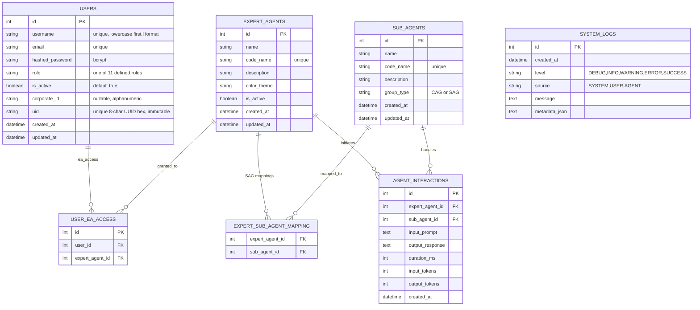

# Technical Specification: AI-Agent Application Framework (CDAGS)

**Project:** CDAGS AI-Agents: OT-IT Convergence & Cybersecurity
**Pattern:** Mixture of Experts (MoE)
**Status:** Iteration 3b (User Management Polish) COMPLETE — Iteration 4 IN PLANNING
**Last updated:** 2026-06-13
**Branch:** `iteration-2`

---

## 1. System Architecture & Design Patterns

The AI-Agent Application Framework orchestrates a set of specialized **Expert AI Agents** and **Sub-Agents** to solve complex domain-specific tasks in OT (Operational Technology) and IT convergence environments.


> **CAG vs SAG routing:** The Common Agent Group (CAG) is a shared pool — every Expert Agent can invoke any CAG sub-agent implicitly. SAG sub-agents (Modbus, Safety Compliance) are restricted to explicitly authorized Expert Agents via the `expert_sub_agent_mapping` table.

### 1.1 The Mixture of Experts (MoE) Pattern

1. **Orchestrator (Router)**: Receives requests, routes them to the correct Expert Agent, enforces CAG/SAG access rules, and maintains global system state. *(Iteration 4 target)*
2. **Expert Agents**: Domain-specific agents with deep functional knowledge of one OT domain. Each has a `code_name`, `color_theme`, and a list of authorized SAG sub-agents.
3. **Sub-Agents**: Utility agents in two groups:
   - **CAG (Common Agent Group)**: Available to all Expert Agents implicitly (`group_type = "CAG"`). Never stored in the mapping table.
   - **SAG (Specific Agent Group)**: Restricted to one or more explicitly authorized Expert Agents. Pairings stored in `expert_sub_agent_mapping`.

### 1.2 Agent Communication Protocol

- **Input payload**: JSON object — `transaction_id`, `caller_agent`, `target_agent`, `routing_group`, `payload`.
- **Output payload**: JSON object — `transaction_id`, `status`, `executing_agent`, `payload`, `errors`.
- **Interactions are persisted** in the `agent_interactions` table for auditing and analytics.
- Protocol detail: see Section 4.1.

---

## 2. Backend Technical Specification (Python & FastAPI)

**Stack:** Python 3.10+, FastAPI, SQLAlchemy 2.x, SQLite, passlib/bcrypt, python-jose JWT
**Virtual environment:** `appsFrame/` (root-level venv — never committed)
**Run directory:** `backend/`

### 2.1 Backend Directory Structure — Current State

```
backend/
├── app/
│   ├── __init__.py
│   ├── main.py                 # FastAPI app init, CORS, lifespan, router registration
│   ├── database.py             # SQLAlchemy engine, SessionLocal, Base, get_db()
│   ├── models/
│   │   ├── __init__.py
│   │   ├── agent.py            # ExpertAgent, SubAgent, AgentInteraction, mapping table
│   │   ├── log.py              # SystemLog model
│   │   └── user.py             # User + UserEaAccess models (Iteration 3)
│   ├── schemas/
│   │   ├── __init__.py
│   │   ├── agent.py            # SubAgentResponse, ExpertAgentResponse, AgentSelectResponse,
│   │   │                       #   AgentInteractionResponse
│   │   ├── log.py              # SystemLogCreate, SystemLogResponse
│   │   └── user.py             # UserLogin, LoginResponse, UserCreate, UserResponse,
│   │                           #   VALID_ROLES, UserCreateAdmin, UserListItem, UserUpdate,
│   │                           #   PasswordReset, EaAccessItem, EaAccessUpdate
│   └── api/
│       ├── __init__.py
│       ├── auth.py             # POST /api/auth/login + require_jwt() + pwd_context
│       ├── agents.py           # GET /api/agents/, POST /api/agents/{id}/select (JWT enforced)
│       ├── logs.py             # GET /api/logs/, POST /api/logs/ (JWT enforced)
│       └── users.py            # /api/users/ CRUD + EA access endpoints (Iteration 3)
├── seed.py                     # Idempotent DB seed — _get_or_create(), no drop_all
│                               # Auto-migrates schema via ALTER TABLE + index creation
│                               # Seeds 8 Expert Agents + 5 Sub-Agents + 2 SAG mappings
│                               # Seeds admin (legacy) + mike.k (superuser)
├── database_test.py            # Manual DB connectivity test script
└── requirements.txt
```

> **Not yet built (Iteration 4):**
> - `app/services/` — agent engine, CAG/SAG routing logic
> - `app/api/orchestrator.py` — POST /api/orchestrate endpoint
> - `backend/tests/` — Pytest test suite
> - `PATCH /api/agents/{id}` — activate/deactivate endpoint (backend toggle, UI ready)

### 2.2 Database Schema — Current State



### 2.3 RBAC — Role Definitions

| Role string | Short code | Description |
|-------------|------------|-------------|
| `superuser` | SU | Full system control — all UI views, all endpoints, User Mgmt |
| `operator` | OPR | Read-only + can activate/deactivate Expert Agents |
| `admin-data-manager` | DATA | Admin for OT Plant Data Manager EA |
| `admin-asset-register-manager` | ASSET-REG | Admin for OT Plant Asset Register Manager EA |
| `admin-asset-risk-manager` | ASSET-RISK | Admin for OT Plant Asset Risk Register Manager EA |
| `admin-change-manager` | CHANGE | Admin for OT Plant Change Management Manager EA |
| `admin-logging-manager` | LOG | Admin for OT Plant Logging & Monitoring Manager EA |
| `admin-siem-manager` | SIEM | Admin for OT Plant Security Incident Manager EA |
| `admin-reports-manager` | REPORTS | Admin for OT Plant Analytics & Report Manager EA |
| `general-user` | GENERAL | Prompt Window + Health Status only; EA access is per-user list |
| `admin` | — | Legacy — kept during migration, remove later |

> **`general-user` EA access** is controlled by the `user_ea_access` join table. A superuser can grant or revoke access to individual Expert Agents per general-user from the User Mgmt view.

### 2.4 Pydantic Schemas — Current State

#### `schemas/user.py` — User Management (Iteration 3 additions)

```python
VALID_ROLES: frozenset = frozenset({
    "superuser", "operator",
    "admin-data-manager", "admin-asset-register-manager",
    "admin-asset-risk-manager", "admin-change-manager",
    "admin-logging-manager", "admin-siem-manager",
    "admin-reports-manager", "general-user", "admin",
})

class UserCreateAdmin(BaseModel):
    username:     str           # first_name.last_initial, lowercase
    email:        EmailStr
    password:     str           # min 8 chars
    role:         str           # validated against VALID_ROLES
    corporate_id: Optional[str] # alphanumeric external ID
    is_active:    bool = True

class UserListItem(BaseModel):
    id: int; uid: str; username: str; email: str
    role: str; is_active: bool; corporate_id: Optional[str]
    created_at: datetime; updated_at: Optional[datetime]

class UserUpdate(BaseModel):    # all Optional — partial PATCH
    email: Optional[EmailStr]; role: Optional[str]
    corporate_id: Optional[str]; is_active: Optional[bool]

class PasswordReset(BaseModel):
    new_password: str           # min 8 chars

class EaAccessItem(BaseModel):
    id: int; user_id: int; expert_agent_id: int

class EaAccessUpdate(BaseModel):
    expert_agent_id: int
```

### 2.5 API Endpoints — Current State

| Method | Endpoint | Auth | Description |
|--------|----------|------|-------------|
| `POST` | `/api/auth/login` | None | bcrypt verify + HS256 JWT |
| `GET` | `/api/agents/` | JWT | All Expert Agents with SAG sub-agents |
| `POST` | `/api/agents/{id}/select` | JWT | Register selection, write USER log |
| `GET` | `/api/logs/` | JWT | Recent logs, newest-first (`?limit=` 1–500) |
| `POST` | `/api/logs/` | JWT | Add log entry (audit trail from admin UI) |
| `GET` | `/api/users/` | JWT + superuser | List all users ordered by username |
| `POST` | `/api/users/` | JWT + superuser | Create user — validates role, generates uid |
| `PATCH` | `/api/users/{id}` | JWT + superuser | Partial update (email, role, is_active, corporate_id) |
| `POST` | `/api/users/{id}/reset-password` | JWT + superuser | Hash and store new password |
| `DELETE` | `/api/users/{id}` | JWT + superuser | Hard delete user |
| `GET` | `/api/users/{id}/ea-access` | JWT + superuser | List EA access for user |
| `POST` | `/api/users/{id}/ea-access` | JWT + superuser | Grant EA access |
| `DELETE` | `/api/users/{id}/ea-access/{ea_id}` | JWT + superuser | Revoke EA access |
| `POST` | `/api/users/export` | JWT + superuser | Stream Excel (.xlsx) of full user roster |
| `POST` | `/api/users/iam-lookup` | JWT + superuser | Query LDAP for corporate_id by email; 503 if IAM_* env vars absent |
| `GET` | `/health` | None | `{"status": "ok"}` |

> **Pending (Iteration 4):** `PATCH /api/agents/{id}` — toggle `is_active` on ExpertAgent.

### 2.6 Auth Implementation

Two FastAPI dependency functions in `app/api/auth.py`:

```python
# JWT validation — used by all protected endpoints
def require_jwt(credentials = Security(_bearer)) -> dict:
    payload = jwt.decode(credentials.credentials, _JWT_SECRET, algorithms=[_JWT_ALGORITHM])
    return payload   # raises 401 on failure

# Superuser gate — wraps require_jwt, used by all /api/users/ endpoints
def require_superuser(payload = Depends(require_jwt)) -> dict:
    if payload.get("role") not in ("superuser", "admin"):
        raise HTTPException(403, "Superuser role required")
    return payload
```

The JWT payload includes `sub` (username), `id`, `role`, and `exp`. The frontend detects 401 and calls `logout()` automatically.

### 2.7 Database Seed Data

Run: `cd backend && python seed.py`

`seed.py` is idempotent — `_get_or_create()` pattern, no `drop_all()`. Safe to re-run. Auto-migrates schema via `ALTER TABLE` + `CREATE UNIQUE INDEX` (SQLite limitation workaround).

#### Migrations applied by seed.py

| Column | Table | Added in |
|--------|-------|----------|
| `code_name` | `sub_agents` | Iteration 2 |
| `is_active` | `users` | Iteration 3 |
| `corporate_id` | `users` | Iteration 3 |
| `uid` | `users` | Iteration 3 |

#### Seeded Users

| Username | Role | Password |
|----------|------|----------|
| `admin` | `admin` (legacy) | `admin` |
| `mike.k` | `superuser` | `Admin1234!` |

#### Expert Agents (8 records)

| Name | code_name | color_theme |
|------|-----------|-------------|
| UI Color Palate Manager | `ui_color_palate_manager` | `#334155` |
| OT Plant Data Manager | `ot_plant_data_manager` | `#1e3a8a` |
| OT Plant Asset Register Manager | `ot_plant_asset_register_manager` | `#0f766e` |
| OT Plant Asset Risk Register Manager | `ot_plant_asset_risk_register_manager` | `#15803d` |
| OT Plant Change Management Manager | `ot_plant_change_management_manager` | `#991b1b` |
| OT Plant Logging & Monitoring Manager | `ot_plant_logging_monitoring_manager` | `#b45309` |
| OT Plant Security Incident Manager | `ot_plant_security_incident_manager` | `#4338ca` |
| OT Plant Analytics & Report Manager | `ot_plant_analytics_report_manager` | `#0369a1` |

#### Sub-Agents (5 records)

| Name | code_name | group_type | Authorized Expert Agents |
|------|-----------|------------|--------------------------|
| Email Agent | `email_agent` | `CAG` | All (implicit) |
| Alert Notification Agent | `alert_notification_agent` | `CAG` | All (implicit) |
| Trouble Ticket Agent | `trouble_ticket_agent` | `CAG` | All (implicit) |
| Modbus Protocol Agent | `modbus_protocol_agent` | `SAG` | OT Plant Data Manager |
| Safety Compliance Agent | `safety_compliance_agent` | `SAG` | OT Plant Asset Register Manager |

### 2.8 Environment Variables

Required in `backend/app/.env`:

```
DATABASE_URL=sqlite:///./cdags_framework.db
JWT_SECRET_KEY=<random 32-byte hex — generate: openssl rand -hex 32>
JWT_EXPIRE_MINUTES=60
```

---

## 3. Frontend Technical Specification (React & TypeScript)

**Stack:** React 19, TypeScript, Vite 8, Vanilla CSS
**Dev port:** `6173` (strict — fails if occupied)
**API proxy:** `/api/*` → `http://localhost:8000`, `/health` → `http://localhost:8000`

### 3.1 Frontend Directory Structure — Current State

```
frontend/
├── index.html
├── package.json
├── tsconfig.json
├── tsconfig.app.json
├── vite.config.ts
└── src/
    ├── main.tsx
    ├── App.tsx                         # Provider tree + AuthCheckGate (hash router)
    ├── vite-env.d.ts
    ├── types/
    │   └── index.ts                    # All shared TypeScript interfaces and constants
    ├── context/
    │   ├── AuthContext.tsx             # Session state, login (JWT), logout
    │   ├── AgentContext.tsx            # Agent list, polling, Authorization headers
    │   └── ThemeContext.tsx            # Light/dark toggle, body class, localStorage
    ├── components/
    │   ├── Layout/
    │   │   ├── Banner.tsx              # Logo, clock, theme toggle, ⚙ Admin button
    │   │   ├── Sidebar.tsx             # Agent list + active highlight
    │   │   ├── LogPanel.tsx            # Live log console, auto-scroll
    │   │   └── Footer.tsx
    │   ├── Agent/
    │   │   ├── AgentGrid.tsx
    │   │   └── AgentTile.tsx
    │   └── Auth/
    │       └── LoginForm.tsx
    ├── admin/
    │   ├── AdminApp.tsx                # AdminShell — viewMode state, activeView state
    │   ├── hooks/
    │   │   ├── useAdminAgents.ts       # Agent management + logAdminAction()
    │   │   └── useUserMgmt.ts          # User CRUD + EA access + logAdminAction()
    │   └── components/
    │       ├── AdminBanner.tsx         # Grid/Tile toggle (disabled for non-grid views)
    │       ├── AdminNav.tsx            # Left nav — 4 views
    │       ├── AdminFooter.tsx
    │       └── views/
    │           ├── UserMgmtView.tsx    # Full user management UI (Iteration 3)
    │           ├── AgentMgmtView.tsx   # Agent table/tile, Activate/Deactivate
    │           ├── PromptWindowView.tsx
    │           └── HealthStatusView.tsx
    └── styles/
        ├── variables.css
        ├── global.css
        ├── layouts.css
        └── components.css
```

### 3.2 Hash-Based Dual-App Routing

```
/#          →  DashboardShell   (agent grid, log panel — read-only)
/#admin     →  AdminShell       (admin-only, role-gated in UI)
```

`AuthCheckGate` listens to `hashchange` events. No react-router dependency.

### 3.3 Dashboard App (`/#`)

- Read-only view of all 8 Expert Agents in auto-fit grid layout
- Live log console polling every 2s (pauses when tab is hidden via Page Visibility API)
- Sidebar shows agent list with active selection highlight
- Banner shows `⚙ Admin` button only for `role === 'admin'` or `role === 'superuser'`

### 3.4 Admin App (`/#admin`)

#### Layout
```
rows:    var(--banner-height)  1fr  var(--footer-height)
columns: 240px  1fr
areas:   "admin-banner admin-banner"
         "admin-nav    admin-main"
         "admin-footer admin-footer"
```

#### Left Nav Views

| View | Key | Status |
|------|-----|--------|
| User Management | `user-mgmt` | Implemented (Iteration 3) |
| AI-Agent Management | `agent-mgmt` | Implemented (Iteration 2) |
| Prompt Window | `prompt-window` | Placeholder |
| Health Status | `health-status` | Implemented (Iteration 2) |

#### Grid / Tile Toggle

`viewMode: 'grid' | 'tile'` is held in `AdminShell`. The Grid/Tile toggle buttons in `AdminBanner` are **disabled** (opacity 0.35, `cursor: not-allowed`) when `activeView` is `user-mgmt` or `prompt-window` — views with no grid/tile variants.

#### AI-Agent Management View

- **Grid mode**: table — agent name, color swatch, Active/Inactive badge, sub-agents, action button
- **Tile mode**: cards — color border, agent name, Active/Inactive badge, action button
- **Activate button**: neon green (`#00ff88`), green border (`#15803d`)
- **Deactivate button**: neon orange (`#ff6a00`), dark orange border (`#c2410c`)
- **Confirmation dialog**: `window.confirm()` before every toggle — names agent, warns action is logged
- **Audit logging**: every confirmed action posts to `POST /api/logs/` via `logAdminAction()`
- **Toggle itself**: NOT yet wired to backend — shows toast "Toggle not yet implemented" (pending Iteration 4 `PATCH /api/agents/{id}`)

#### Health Status View

- Backend API health: `GET /health` — green/red dot + status
- Expert Agent status: `GET /api/agents/`
- **Grid mode**: table — name, color swatch, Active/Inactive dot, type
- **Tile mode**: cards — color border, name, Active/Inactive dot

#### User Management View

Full CRUD UI — superuser only. Three sections:

**Section 1 — Add/Edit Form**

| Field | Editable | Notes |
|-------|----------|-------|
| Username | Add only | Locked in edit mode; format `first.l` (regex validated) |
| Full Name | Yes | Display name e.g. "Alice Smith"; optional; auto-filled by IAM Lookup |
| Email | Yes | EmailStr validated |
| Default / Reset Password | Add: required (min 8) · Edit: blank = keep current; explicit confirm before reset |
| Corporate ID | Yes | Optional; auto-filled by IAM Lookup button |
| IAM Lookup | Button | Queries FreeIPA/Keycloak LDAP; fills Corporate ID + Full Name; 503 if unconfigured |
| Date Created | Read-only | Auto-generated — darker background, muted text |
| System UID | Read-only | 8-char UUID hex, monospace — darker background, muted text |
| Role | Yes | `<select>` from `ROLE_LABELS` |

**Unsaved-changes guard**: when any field is changed, the form border turns blue and "● unsaved changes" appears. Clicking another row or Clear prompts "Discard and continue?" if dirty.

**Section 2 — Search / Filter Bar + Role Matrix Table**

- **Search**: live text filter covers `username`, `full_name`, and `email` — `✕` clear button
- **Role filter**: `SHORT — Full Name` format (e.g. `SU — Superuser`), `✕` clear button
- **Status filter**: All / Active only / Suspended only, `✕` clear button
- All three filters compose; match count shows `N / M users`
- **Table**: sticky header, `max-height: 420px`, `overflow-y: auto` scroll
- **Sortable columns**: Username, Role, and Status — click to toggle ▲/▼, dimmed `⇅` when inactive
- **Columns**: Username | Full Name | UID | Status | Role | SU | OPR | DATA | ASSET-REG | ASSET-RISK | CHANGE | LOG | SIEM | REPORTS | GENERAL | Actions
- **RoleDot**: 12px circle — neon green `#00ff88` = current role, crimson `#dc143c` = other. Display-only — role changes must go through the form's Role dropdown + Update button
- **Status**: "Active" in `#00ff88`, "Suspended" in `#ff6a00`
- **Actions**: Suspend/Restore (orange/green) + Delete (crimson) with confirm dialogs
- **Delete guard**: backend rejects self-delete (400) and last-superuser-delete (400)

**Section 3 — EA Access Panel** (general-user only)

Shown below the table when a `general-user` row is selected. Lists all 8 Expert Agents as toggle cards. Green border + green dot = access granted; crimson dot = no access. Click to toggle. Panel fades during in-flight requests; `eaBusy` flag prevents double-click races. Full Name shown beside username in panel header.

**Toast system**: fixed bottom-center.
- Info toasts: dark background, auto-dismiss 4s
- Error toasts: red-tinted background + border, auto-dismiss 7s

**Role short codes** (column headers):

| Role | Short Code |
|------|-----------|
| superuser | SU |
| operator | OPR |
| admin-data-manager | DATA |
| admin-asset-register-manager | ASSET-REG |
| admin-asset-risk-manager | ASSET-RISK |
| admin-change-manager | CHANGE |
| admin-logging-manager | LOG |
| admin-siem-manager | SIEM |
| admin-reports-manager | REPORTS |
| general-user | GENERAL |

### 3.5 TypeScript Types (`src/types/index.ts`)

```typescript
export interface UserSession { id, token, username, role }
export interface SubAgent { id, name, description?, group_type, created_at, updated_at? }
export interface ExpertAgent { id, name, description?, color_theme, is_active, created_at, updated_at?, specific_sub_agents }
export interface SystemLog { id, created_at, level, source, message, metadata_json? }

export type AdminNavView = 'user-mgmt' | 'agent-mgmt' | 'prompt-window' | 'health-status';
export type ViewMode = 'grid' | 'tile';

export type UserRole =
  | 'superuser' | 'operator'
  | 'admin-data-manager' | 'admin-asset-register-manager'
  | 'admin-asset-risk-manager' | 'admin-change-manager'
  | 'admin-logging-manager' | 'admin-siem-manager'
  | 'admin-reports-manager' | 'general-user' | 'admin';

export const ALL_ROLES: UserRole[]              // 10 roles (excludes 'admin' legacy)
export const ROLE_LABELS: Record<UserRole, string>  // human-readable labels
export const ROLE_SHORT: Record<string, string>     // SU, OPR, DATA, …, GENERAL

export interface UserListItem { id, uid, username, email, role, is_active, corporate_id, created_at, updated_at }
export interface UserCreatePayload { username, email, password, role, corporate_id?, is_active? }
export interface UserUpdatePayload { email?, role?, corporate_id?, is_active? }
export interface EaAccessItem { id, user_id, expert_agent_id }
```

### 3.6 CSS Design System

#### Tokens (`variables.css`)
- `--active-highlight`: neon blue `#3b82f6` (light) / `#60a5fa` (dark)
- `--bg-primary`, `--bg-secondary`, `--bg-tertiary`: layered backgrounds
- `--border-color`, `--text-primary`, `--text-secondary`, `--text-tertiary`
- `--banner-height`: `60px`, `--footer-height`: `30px`

#### Neon accents
- `#00f0ff` — "CDAGS" in both banners
- `#00ff88` — Activate button, Active status, current-role dot
- `#ff6a00` — Deactivate/Suspend button
- `#dc143c` — Delete button, non-active role dot

#### Read-only field distinction (User Mgmt form)
- Editable inputs: `background: var(--bg-tertiary)`, visible border
- Read-only info fields (Date Created, System UID): `background: #1a1f2e`, `border: 1px solid transparent`, `color: var(--text-tertiary)`, `cursor: default`

---

## 4. Integration & Protocol Definition

### 4.1 Agent-to-Agent JSON Protocol

```json
// Request
{
  "transaction_id": "tx_8f8e02d8-2615-46b0-bbcb",
  "timestamp": "2026-06-09T10:31:52Z",
  "caller_agent": "ot_plant_data_manager",
  "target_agent": "email_agent",
  "routing_group": "CAG",
  "payload": { "recipients": ["..."], "subject": "...", "body": "...", "severity": "CRITICAL" }
}

// Response
{
  "transaction_id": "tx_8f8e02d8-2615-46b0-bbcb",
  "status": "SUCCESS",
  "executing_agent": "email_agent",
  "payload": { "message_id": "msg_90847291", "delivered": true, "relay_latency_ms": 142 },
  "errors": null
}
```

### 4.2 Logging Protocol

| Source | Used for |
|--------|----------|
| `USER` | UI clicks, tile selections, admin actions (audit trail) |
| `SYSTEM` | Startup, DB operations |
| `AGENT` | Expert→sub-agent calls, completions, routing errors |

Admin action log format:
```
Superuser "<username>" <action> user "<target>" (id=<id>).
Admin "<username>" attempted to <activate|deactivate> agent "<name>" (id=<id>).
```

---

## 5. Iteration Status

### Iteration 1 — COMPLETE ✓

| Task | Status |
|------|--------|
| SQLite models: User, ExpertAgent, SubAgent, AgentInteraction, SystemLog | ✓ |
| FastAPI app with CORS, lifespan DB init | ✓ |
| Auth endpoint — real bcrypt + HS256 JWT | ✓ |
| Agent list + select endpoints | ✓ |
| Log create + fetch endpoints | ✓ |
| React SPA — full layout (Banner/Sidebar/Grid/LogPanel/Footer) | ✓ |
| Light/Dark theme system | ✓ |
| Live log console with 2s polling and auto-scroll | ✓ |
| Agent tile per-color border and glow | ✓ |
| TypeScript — zero `tsc --noEmit` errors | ✓ |

### Iteration 2 — COMPLETE ✓

| Task | Status |
|------|--------|
| `seed.py` made idempotent — `_get_or_create()`, no `drop_all` | ✓ |
| 5 sub-agents seeded (3 CAG, 2 SAG) + 2 SAG mappings | ✓ |
| `SubAgent.code_name` column added (ALTER TABLE + UNIQUE INDEX) | ✓ |
| `require_jwt()` enforced on all protected endpoints | ✓ |
| Frontend sends `Authorization: Bearer` on all API calls | ✓ |
| Frontend 401 → auto-logout | ✓ |
| Log polling pauses when tab is hidden (Page Visibility API) | ✓ |
| Admin App shell at `/#admin` (hash-based dual-app routing) | ✓ |
| Admin banner, left nav (4 views), footer | ✓ |
| `⚙ Admin` button in dashboard banner | ✓ |
| Grid/Tile toggle in admin banner | ✓ |
| AgentMgmtView — grid + tile layouts, Activate/Deactivate buttons | ✓ |
| HealthStatusView — backend health + agent status, grid + tile | ✓ |
| Deactivate: neon orange; Activate: neon green; confirm dialog | ✓ |
| Audit logging via `POST /api/logs/` on every admin action | ✓ |

### Iteration 3 — COMPLETE ✓

| Task | Status |
|------|--------|
| 10-role RBAC definition (`VALID_ROLES`) | ✓ |
| `User` model: `is_active`, `corporate_id`, `uid` columns added | ✓ |
| `UserEaAccess` join table (general-user EA access list) | ✓ |
| `seed.py` migrations for 3 new User columns + uid back-fill | ✓ |
| `seed.py` idempotent seed log (no duplicate SYSTEM entries) | ✓ |
| `mike.k` superuser seeded | ✓ |
| `/api/users/` CRUD endpoints — 8 total (superuser-gated) | ✓ |
| `/api/users/{id}/ea-access` — grant/revoke EA access | ✓ |
| `require_superuser()` dependency (wraps `require_jwt`, 403 on fail) | ✓ |
| `useUserMgmt.ts` React hook — full CRUD + EA access + logAdminAction | ✓ |
| `UserMgmtView.tsx` — access guard, add/edit form, role matrix table | ✓ |
| Password show/hide SVG eye icon toggle | ✓ |
| Read-only field styling (Date Created, System UID — darker bg) | ✓ |
| Role matrix table: sticky header, max-height scroll | ✓ |
| Username live search filter with `✕` clear | ✓ |
| Role filter dropdown (`SU — Superuser`, etc.) with `✕` clear | ✓ |
| Username and Status sortable columns (▲/▼ toggle) | ✓ |
| EA Access Panel for general-user rows | ✓ |
| Role short codes: CHANGE, REPORTS, GENERAL (updated from CHG/RPT/GEN) | ✓ |
| Grid/Tile toggle disabled for user-mgmt and prompt-window views | ✓ |
| `⚙ Admin` button visible for superuser role (not just admin) | ✓ |
| `npx tsc --noEmit` — zero errors | ✓ |

### Iteration 3b — COMPLETE ✓

User Management polish and three functional enhancements.

#### New backend
| Task | Status |
|------|--------|
| `full_name` column added to `users` table (seed.py migration) | ✓ |
| `UserCreateAdmin`, `UserListItem`, `UserUpdate` schemas include `full_name` | ✓ |
| `IamLookupRequest` schema added | ✓ |
| `POST /api/users/export` — openpyxl Excel in-memory, StreamingResponse | ✓ |
| `POST /api/users/iam-lookup` — FreeIPA/Keycloak LDAP query; 503 if unconfigured | ✓ |
| `DELETE /api/users/{id}` — rejects self-delete (400) and last-superuser-delete (400) | ✓ |
| `openpyxl==3.1.5`, `ldap3==2.9.1` added to `requirements.txt` | ✓ |

#### New frontend
| Task | Status |
|------|--------|
| `full_name` field in form Row 1; populates from IAM lookup | ✓ |
| `IamLookupResult` type added to `src/types/index.ts` | ✓ |
| `exportUsers()`, `iamLookup()` added to `useUserMgmt.ts` | ✓ |
| "Export & Download" triggers real browser `.xlsx` download via blob URL | ✓ |
| IAM Lookup button inline with Corporate ID — busy/spinner state | ✓ |
| Full Name column in role matrix table | ✓ |
| Search expands to cover `username`, `full_name`, and `email` | ✓ |
| Status filter dropdown (All / Active only / Suspended only) | ✓ |
| Role column added to table with sortable arrow | ✓ |
| Role dots are display-only — role changes via form only (eliminates misclick risk) | ✓ |
| `isDirty` unsaved-changes indicator — blue border + "● unsaved changes" label | ✓ |
| `confirmDiscardIfDirty()` — warns before switching rows or clearing with unsaved changes | ✓ |
| Password reset on Update requires explicit `window.confirm()` — prevents accidental reset | ✓ |
| Toast system split: info (dark) vs error (red-tinted, 7s) | ✓ |
| EA Access panel: opacity fade + `eaBusy` flag prevents double-click races | ✓ |
| EA Access panel shows `full_name` beside username | ✓ |
| `npx tsc --noEmit` — zero errors | ✓ |

#### IAM environment variables (optional — all four required to enable lookup)
```
IAM_LDAP_URL=ldap://ipa.cdags.local
IAM_BIND_DN=cn=readonly,dc=cdags,dc=local
IAM_BIND_PASSWORD=<readonly-svc-account-pw>
IAM_SEARCH_BASE=dc=cdags,dc=local
```

### Iteration 4 — PLANNED (Next)

#### Backend

| Task | Priority | Notes |
|------|----------|-------|
| `PATCH /api/agents/{id}` — toggle `is_active` on ExpertAgent | High | UI is ready and wired; only backend missing |
| `app/services/agent_engine.py` — `get_available_sub_agents()`, `dispatch()` | High | Core MoE execution layer |
| `app/services/orchestrator.py` — Expert Agent routing/scoring | High | Selects EA from request domain |
| `app/api/orchestrator.py` — `POST /api/orchestrate` | High | Entry point for agent task execution |
| `backend/tests/` — Pytest suite (auth, agents, users, orchestrate) | Medium | No tests exist yet |
| `app/config.py` — centralized env/config | Low | Currently loaded inline |

#### Frontend

| Task | Priority | Notes |
|------|----------|-------|
| Wire Activate/Deactivate to `PATCH /api/agents/{id}` | High | Currently shows "not implemented" toast |
| PromptWindowView — chat interface to orchestrator | High | Placeholder currently |
| Role-based app at `/#app` | Medium | Non-admin RBAC-gated views |
| React error boundary | Low | Unhandled errors crash full app |
| Frontend test suite | Low | No tests exist |

#### Architecture (Future)

| Topic | Notes |
|-------|-------|
| Email gateway integration | Inbound email per EA, webhook → orchestrator |
| Result short-link system | `GET /r/{short_id}` — agent result stored, tiny URL in email |
| RBAC enforcement at `/#app` | Show only permitted views per user role |

---

## 6. Running the Project

### Backend
```bash
cd backend
source ../appsFrame/bin/activate
uvicorn app.main:app --reload --port 8000
```

### Seed the database (first time or after reset — safe to re-run)
```bash
cd backend
source ../appsFrame/bin/activate
python seed.py
```

### Frontend
```bash
cd frontend
npm install        # first time only
npm run dev        # http://localhost:6173
```

### TypeScript check (run before every commit)
```bash
cd frontend
npx tsc --noEmit
```

### Logins

| Username | Password | Role |
|----------|----------|------|
| `admin` | `admin` | admin (legacy) |
| `mike.k` | `Admin1234!` | superuser |
