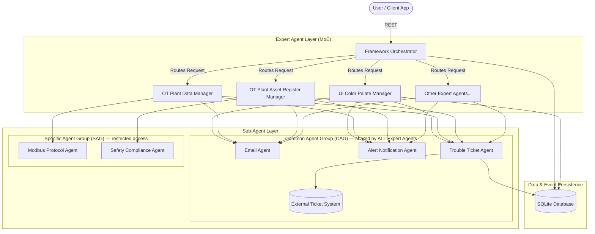
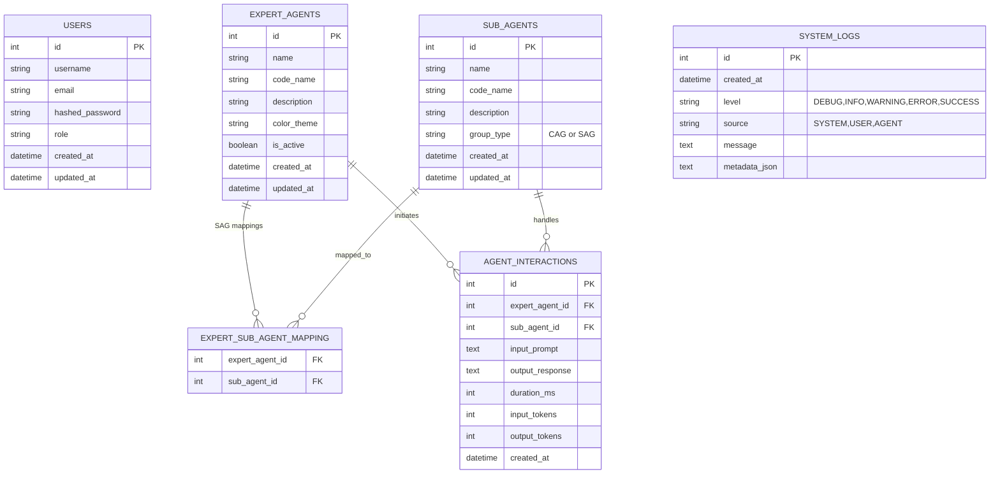

# Technical Specification: AI-Agent Application Framework (CDAGS)

**Project:** CDAGS AI-Agents: OT-IT Convergence & Cybersecurity
**Pattern:** Mixture of Experts (MoE)
**Status:** Iteration 2 (Admin App) COMPLETE — Iteration 3 IN PLANNING
**Last updated:** 2026-06-13
**Branch:** `iteration-2`

---

## 1. System Architecture & Design Patterns

The AI-Agent Application Framework orchestrates a set of specialized **Expert AI Agents** and **Sub-Agents** to solve complex domain-specific tasks in OT (Operational Technology) and IT convergence environments.



> **CAG vs SAG routing:** The Common Agent Group (CAG) is a shared pool — every Expert Agent can invoke any CAG sub-agent implicitly. SAG sub-agents (Modbus, Safety Compliance) are restricted to explicitly authorized Expert Agents via the `expert_sub_agent_mapping` table.

### 1.1 The Mixture of Experts (MoE) Pattern

1. **Orchestrator (Router)**: Receives requests, routes them to the correct Expert Agent, enforces CAG/SAG access rules, and maintains global system state. *(Iteration 3 target)*
2. **Expert Agents**: Domain-specific agents with deep functional knowledge of one OT domain. Each has a `code_name`, `color_theme`, and a list of authorized SAG sub-agents.
3. **Sub-Agents**: Utility agents in two groups:
   - **CAG (Common Agent Group)**: Available to all Expert Agents implicitly (`group_type = "CAG"`). Never stored in the mapping table.
   - **SAG (Specific Agent Group)**: Restricted to one or more explicitly authorized Expert Agents. Pairings stored in `expert_sub_agent_mapping`.

### 1.2 Agent Communication Protocol

- **Input payload**: JSON object — `transaction_id`, `caller_agent`, `target_agent`, `routing_group`, `payload`.
- **Output payload**: JSON object — `transaction_id`, `status`, `executing_agent`, `payload`, `errors`.
- **Interactions are persisted** in the `agent_interactions` table for auditing and analytics.
- Protocol detail: see Section 4.1.

---

## 2. Backend Technical Specification (Python & FastAPI)

**Stack:** Python 3.10+, FastAPI, SQLAlchemy 2.x, SQLite, passlib/bcrypt, python-jose JWT
**Virtual environment:** `appsFrame/` (root-level venv — never committed)
**Run directory:** `backend/`

### 2.1 Backend Directory Structure — Current State

```
backend/
├── app/
│   ├── __init__.py
│   ├── main.py                 # FastAPI app init, CORS, lifespan, router registration
│   ├── database.py             # SQLAlchemy engine, SessionLocal, Base, get_db()
│   ├── models/
│   │   ├── __init__.py
│   │   ├── agent.py            # ExpertAgent, SubAgent, AgentInteraction, mapping table
│   │   ├── log.py              # SystemLog model
│   │   └── user.py             # User model (username, email, hashed_password, role)
│   ├── schemas/
│   │   ├── __init__.py
│   │   ├── agent.py            # SubAgentResponse, ExpertAgentResponse, AgentSelectResponse,
│   │   │                       #   AgentInteractionResponse
│   │   ├── log.py              # SystemLogCreate, SystemLogResponse
│   │   └── user.py             # UserLogin, LoginResponse, UserCreate, UserResponse
│   └── api/
│       ├── __init__.py
│       ├── auth.py             # POST /api/auth/login + require_jwt() dependency
│       ├── agents.py           # GET /api/agents/, POST /api/agents/{id}/select (JWT enforced)
│       └── logs.py             # GET /api/logs/, POST /api/logs/ (JWT enforced)
├── seed.py                     # Idempotent DB seed — _get_or_create() pattern, no drop_all
│                               # Auto-migrates sub_agents.code_name via ALTER TABLE + index
│                               # Seeds 8 Expert Agents + 5 Sub-Agents + 2 SAG mappings
├── database_test.py            # Manual DB connectivity test script
└── requirements.txt            # Python dependencies
```

> **Not yet built (Iteration 3):**
> - `app/services/` — agent engine, CAG/SAG routing logic
> - `app/api/orchestrator.py` — POST /api/orchestrate endpoint
> - `backend/tests/` — Pytest test suite
> - `PATCH /api/agents/{id}` — activate/deactivate endpoint

### 2.2 Database Schema — Current State



### 2.3 Pydantic Schemas — Current State

#### `schemas/agent.py`

```python
class SubAgentResponse(BaseModel):
    id: int
    name: str
    description: Optional[str]
    group_type: str               # "CAG" or "SAG"
    created_at: datetime
    updated_at: Optional[datetime]

class ExpertAgentResponse(BaseModel):
    id: int
    name: str
    description: Optional[str]
    color_theme: str
    is_active: bool
    created_at: datetime
    updated_at: Optional[datetime]
    specific_sub_agents: List[SubAgentResponse] = []   # SAG sub-agents only

class AgentSelectResponse(BaseModel):
    status: str
    message: str
    agent_id: int

class AgentInteractionResponse(BaseModel):
    id: int
    expert_agent_id: int
    sub_agent_id: int
    input_prompt: str
    output_response: Optional[str]
    duration_ms: Optional[int]
    input_tokens: Optional[int]
    output_tokens: Optional[int]
    created_at: datetime
```

#### `schemas/log.py`

```python
LogLevel = Literal["DEBUG", "INFO", "WARNING", "ERROR", "SUCCESS"]

class SystemLogCreate(BaseModel):
    level: LogLevel = "INFO"
    source: str = "SYSTEM"
    message: str
    metadata_json: Optional[str] = None

class SystemLogResponse(BaseModel):
    id: int
    created_at: datetime          # field is created_at, not timestamp
    level: LogLevel
    source: str
    message: str
    metadata_json: Optional[str]
```

#### `schemas/user.py`

```python
class UserLogin(BaseModel):
    username: str
    password: str

class LoginResponse(BaseModel):
    status: str
    token: str
    id: int
    username: str
    email: str
    role: str
```

### 2.4 API Endpoints — Current State

| Method | Endpoint | Auth | Response | Description |
|--------|----------|------|----------|-------------|
| `POST` | `/api/auth/login` | None | `LoginResponse` | bcrypt verify + HS256 JWT |
| `GET` | `/api/agents/` | JWT required | `List[ExpertAgentResponse]` | All Expert Agents with SAG `specific_sub_agents` |
| `POST` | `/api/agents/{id}/select` | JWT required | `AgentSelectResponse` | Registers selection, writes USER log entry |
| `GET` | `/api/logs/` | JWT required | `List[SystemLogResponse]` | Recent logs, newest-first. `?limit=` (1–500, default 50) |
| `POST` | `/api/logs/` | JWT required | `SystemLogResponse` | Add a manual log entry (used for audit logging from admin UI) |
| `GET` | `/health` | None | `{"status": "ok"}` | Health check |

> **Pending endpoint (Iteration 3):** `PATCH /api/agents/{id}` — toggle `is_active` on an ExpertAgent. The Admin UI Activate/Deactivate buttons are wired and awaiting this endpoint.

### 2.5 Auth Implementation

`require_jwt()` is a FastAPI `Security` dependency in `app/api/auth.py`:

```python
_bearer = HTTPBearer()
def require_jwt(credentials: HTTPAuthorizationCredentials = Security(_bearer)) -> dict:
    try:
        payload = jwt.decode(credentials.credentials, _JWT_SECRET, algorithms=[_JWT_ALGORITHM])
        return payload
    except JWTError:
        raise HTTPException(status_code=401, detail="Invalid or expired token",
                            headers={"WWW-Authenticate": "Bearer"})
```

All protected endpoints declare `_token: dict = Depends(require_jwt)`. The frontend detects 401 responses and calls `logout()` automatically, clearing localStorage and redirecting to login.

### 2.6 Database Seed Data

Run: `cd backend && python seed.py`

`seed.py` is idempotent — uses `_get_or_create()` pattern, no `drop_all()`. Safe to re-run. Auto-migrates `sub_agents.code_name` column if missing via `ALTER TABLE` + `CREATE UNIQUE INDEX`.

#### Expert Agents (8 records)

| Name | code_name | color_theme |
|------|-----------|-------------|
| UI Color Palate Manager | `ui_color_palate_manager` | `#334155` |
| OT Plant Data Manager | `ot_plant_data_manager` | `#1e3a8a` |
| OT Plant Asset Register Manager | `ot_plant_asset_register_manager` | `#0f766e` |
| OT Plant Asset Risk Register Manager | `ot_plant_asset_risk_register_manager` | `#15803d` |
| OT Plant Change Management Manager | `ot_plant_change_management_manager` | `#991b1b` |
| OT Plant Logging & Monitoring Manager | `ot_plant_logging_monitoring_manager` | `#b45309` |
| OT Plant Security Incident Manager | `ot_plant_security_incident_manager` | `#4338ca` |
| OT Plant Analytics & Report Manager | `ot_plant_analytics_report_manager` | `#0369a1` |

#### Sub-Agents (5 records, seeded)

| Name | code_name | group_type | Authorized Expert Agents |
|------|-----------|------------|--------------------------|
| Email Agent | `email_agent` | `CAG` | All (implicit — not in mapping table) |
| Alert Notification Agent | `alert_notification_agent` | `CAG` | All (implicit) |
| Trouble Ticket Agent | `trouble_ticket_agent` | `CAG` | All (implicit) |
| Modbus Protocol Agent | `modbus_protocol_agent` | `SAG` | OT Plant Data Manager |
| Safety Compliance Agent | `safety_compliance_agent` | `SAG` | OT Plant Asset Register Manager |

### 2.7 Environment Variables

Required in `backend/app/.env`:

```
DATABASE_URL=sqlite:///./cdags_framework.db
JWT_SECRET_KEY=<random 32-byte hex — generate: openssl rand -hex 32>
JWT_EXPIRE_MINUTES=60
```

---

## 3. Frontend Technical Specification (React & TypeScript)

**Stack:** React 19, TypeScript, Vite 8, Vanilla CSS
**Dev port:** `6173` (strict — fails if occupied)
**API proxy:** `/api/*` → `http://localhost:8000`, `/health` → `http://localhost:8000`

### 3.1 Frontend Directory Structure — Current State

```
frontend/
├── index.html
├── package.json
├── tsconfig.json
├── tsconfig.app.json
├── vite.config.ts                  # Port 6173, strictPort, proxy /api + /health → :8000
├── public/
│   ├── favicon.svg
│   ├── icons.svg
│   └── bg-dark-hex.jpg
└── src/
    ├── main.tsx
    ├── App.tsx                     # Provider tree + AuthCheckGate (hash router)
    ├── vite-env.d.ts
    ├── types/
    │   └── index.ts                # UserSession, SubAgent, ExpertAgent, SystemLog,
    │                               #   AdminNavView, ViewMode
    ├── context/
    │   ├── AuthContext.tsx         # Session state, login (JWT), logout
    │   ├── AgentContext.tsx        # Agent list, active selection, log polling (2s),
    │   │                           #   visibility-aware (Page Visibility API),
    │   │                           #   Authorization header on all fetches,
    │   │                           #   401 → auto-logout
    │   └── ThemeContext.tsx        # Light/dark toggle, body class, localStorage
    ├── components/
    │   ├── Layout/
    │   │   ├── Banner.tsx          # Logo, title, user, live clock, theme toggle,
    │   │   │                       #   ⚙ Admin button (admin role only → /#admin)
    │   │   ├── Sidebar.tsx         # Agent list, active highlight
    │   │   ├── LogPanel.tsx        # Live log console, auto-scroll, newest-at-bottom
    │   │   └── Footer.tsx
    │   ├── Agent/
    │   │   ├── AgentGrid.tsx       # auto-fit grid of agent tiles (grid view, locked)
    │   │   └── AgentTile.tsx       # Per-agent color border + glow, active scale
    │   └── Auth/
    │       └── LoginForm.tsx
    ├── admin/                      # Admin App shell (hash: /#admin)
    │   ├── AdminApp.tsx            # AdminShell — holds viewMode state, renders admin layout
    │   ├── hooks/
    │   │   └── useAdminAgents.ts   # useAdminAgents() + useHealthStatus() + logAdminAction()
    │   └── components/
    │       ├── AdminBanner.tsx     # Admin banner — Grid/Tile toggle, ← Dashboard, Sign Out
    │       ├── AdminNav.tsx        # Left nav — 4 views
    │       ├── AdminFooter.tsx
    │       └── views/
    │           ├── UserMgmtView.tsx        # Placeholder
    │           ├── AgentMgmtView.tsx       # Agent table/tile + Activate/Deactivate buttons
    │           ├── PromptWindowView.tsx    # Placeholder
    │           └── HealthStatusView.tsx   # Backend health + agent status table/tile
    └── styles/
        ├── variables.css           # :root tokens + body.light-theme + body.dark-theme
        ├── global.css              # Reset, imports variables/layouts/components
        ├── layouts.css             # Dashboard CSS grid + admin CSS grid
        └── components.css          # .agent-tile, .agent-grid, .agent-grid-tile, etc.
```

### 3.2 Hash-Based Dual-App Routing

`App.tsx` dispatches between two app shells based on `window.location.hash`:

```
/#          →  DashboardShell  (read-only agent grid, log panel)
/#admin     →  AdminShell      (admin-only, role-gated in UI)
```

`AuthCheckGate` listens to `hashchange` events and re-renders on navigation. No react-router-dom dependency. Both shells share the same React context providers (`AuthContext`, `ThemeContext`).

### 3.3 Dashboard App (/#)

- Read-only view of all 8 Expert Agents in grid layout (locked — no tile toggle on dashboard)
- Live log console polling every 2s (pauses when tab is hidden via Page Visibility API)
- Sidebar shows agent list with active selection
- Banner shows `⚙ Admin` button only for `role === 'admin'` users

### 3.4 Admin App (/#admin)

Admin-only driver app for managing the CDAGS framework.

#### Layout
```
rows:    var(--banner-height)  1fr  var(--footer-height)
columns: 240px  1fr
areas:   "admin-banner admin-banner"
         "admin-nav    admin-main"
         "admin-footer admin-footer"
```
No log panel in admin layout.

#### Left Nav Views

| View | Key | Status |
|------|-----|--------|
| User Management | `user-mgmt` | Placeholder |
| AI-Agent Management | `agent-mgmt` | Implemented |
| Prompt Window | `prompt-window` | Placeholder |
| Health Status | `health-status` | Implemented |

#### Grid / Tile Toggle

`viewMode: 'grid' | 'tile'` state is held in `AdminShell` and passed as props to `AdminBanner`, `AgentMgmtView`, and `HealthStatusView`. The dashboard is locked to grid — toggle only appears in admin banner.

#### AI-Agent Management View

- **Grid mode**: table layout — agent name, color swatch, Active/Inactive badge, sub-agents list, action button
- **Tile mode**: card layout — color border, agent name, Active/Inactive badge, action button
- **Activate button**: neon green (`#00ff88`), green border (`#15803d`)
- **Deactivate button**: neon orange (`#ff6a00`), dark orange border (`#c2410c`)
- **Confirmation dialog**: `window.confirm()` fires before any toggle action, names the agent and warns the action is logged
- **Audit logging**: every confirmed action posts to `POST /api/logs/` with `level: "INFO"`, `source: "USER"`, message includes username + agent name + id
- **Toggle itself**: NOT yet implemented — shows toast "Toggle not yet implemented" pending `PATCH /api/agents/{id}` endpoint

#### Health Status View

- Backend API health check: `GET /health` — shows green/red dot + status string
- Expert Agent status: reads from `GET /api/agents/`
- **Grid mode**: table — agent name, color swatch, Active/Inactive dot, type
- **Tile mode**: cards — color border, agent name, Active/Inactive dot

### 3.5 TypeScript Types (`src/types/index.ts`)

```typescript
export interface UserSession {
  id: number;
  token: string;
  username: string;
  role: string;
}

export interface SubAgent {
  id: number;
  name: string;
  description?: string;
  group_type: string;
  created_at: string;
  updated_at?: string;
}

export interface ExpertAgent {
  id: number;
  name: string;
  description?: string;
  color_theme: string;
  is_active: boolean;
  created_at: string;
  updated_at?: string;
  specific_sub_agents: SubAgent[];
}

export interface SystemLog {
  id: number;
  created_at: string;
  level: string;
  source: string;
  message: string;
  metadata_json?: string;
}

export type AdminNavView = 'user-mgmt' | 'agent-mgmt' | 'prompt-window' | 'health-status';
export type ViewMode = 'grid' | 'tile';
```

### 3.6 CSS Design System

#### Tokens (variables.css)
- `--active-highlight`: neon blue `#3b82f6` (light) / `#60a5fa` (dark)
- `--bg-primary`, `--bg-secondary`, `--bg-tertiary`: layered backgrounds
- `--border-color`, `--text-primary`, `--text-secondary`, `--text-tertiary`
- `--banner-height`: `60px`, `--footer-height`: `30px`

#### Neon accents
- `#00f0ff` — "CDAGS" in both banners, "AI-Agents" in main heading
- `#00ff88` — Activate button
- `#ff6a00` — Deactivate button

#### Agent Tile Colors (from DB `color_theme`)

| Agent | Color |
|-------|-------|
| UI Color Palate Manager | Slate Grey `#334155` |
| OT Plant Data Manager | Navy Blue `#1e3a8a` |
| OT Plant Asset Register Manager | Deep Teal `#0f766e` |
| OT Plant Asset Risk Register Manager | Forest Green `#15803d` |
| OT Plant Change Management Manager | Deep Crimson `#991b1b` |
| OT Plant Logging & Monitoring Manager | Dark Amber `#b45309` |
| OT Plant Security Incident Manager | Purple/Indigo `#4338ca` |
| OT Plant Analytics & Report Manager | Steel Blue `#0369a1` |

---

## 4. Integration & Protocol Definition

### 4.1 Agent-to-Agent JSON Protocol

Expert agents invoke sub-agents via structured JSON. All interactions are persisted in `agent_interactions`.

#### Request Payload
```json
{
  "transaction_id": "tx_8f8e02d8-2615-46b0-bbcb",
  "timestamp": "2026-06-09T10:31:52Z",
  "caller_agent": "ot_plant_data_manager",
  "target_agent": "email_agent",
  "routing_group": "CAG",
  "payload": {
    "recipients": ["safety-lead@plant.cdags.com"],
    "subject": "Warning: Asset Temperature Exceeded",
    "body": "OT Plant Asset id-1082 (Generator Core) registered 98.4C, exceeding 90C threshold.",
    "severity": "CRITICAL"
  }
}
```

#### Response Payload
```json
{
  "transaction_id": "tx_8f8e02d8-2615-46b0-bbcb",
  "timestamp": "2026-06-09T10:31:53Z",
  "status": "SUCCESS",
  "executing_agent": "email_agent",
  "payload": {
    "message_id": "msg_90847291",
    "delivered": true,
    "relay_latency_ms": 142
  },
  "errors": null
}
```

### 4.2 Logging Protocol

All agent actions, user interactions, and system events are written to `system_logs` via `POST /api/logs/`.

| Source | Used for |
|--------|----------|
| `USER` | UI clicks, tile selections, admin actions (audit trail) |
| `SYSTEM` | Startup, DB operations, theme changes |
| `AGENT` | Expert→sub-agent calls, completions, routing errors |

Admin UI actions (Activate/Deactivate button clicks) are posted with `source: "USER"`, `level: "INFO"`, message format:
```
Admin "<username>" attempted to <activate|deactivate> agent "<name>" (id=<id>).
```

---

## 5. Iteration Status

### Iteration 1 — COMPLETE ✓

| Task | Status |
|------|--------|
| SQLite models: User, ExpertAgent, SubAgent, AgentInteraction, SystemLog | ✓ Done |
| FastAPI app with CORS, lifespan DB init | ✓ Done |
| Auth endpoint — real bcrypt + HS256 JWT | ✓ Done |
| Agent list + select endpoints | ✓ Done |
| Log create + fetch endpoints | ✓ Done |
| React SPA — full layout (Banner/Sidebar/Grid/LogPanel/Footer) | ✓ Done |
| Light/Dark theme system | ✓ Done |
| Live log console with 2s polling and auto-scroll | ✓ Done |
| Agent tile per-color border and glow | ✓ Done |
| TypeScript — zero `tsc --noEmit` errors | ✓ Done |

### Iteration 2 — COMPLETE ✓

| Task | Status |
|------|--------|
| `seed.py` made idempotent — `_get_or_create()`, no `drop_all` | ✓ Done |
| 5 sub-agents seeded (3 CAG, 2 SAG) + 2 SAG mappings | ✓ Done |
| `SubAgent.code_name` column added (ALTER TABLE + UNIQUE INDEX) | ✓ Done |
| `require_jwt()` dependency — JWT enforced on all protected endpoints | ✓ Done |
| Frontend sends `Authorization: Bearer` header on all API calls | ✓ Done |
| Frontend 401 → auto-logout (clears stale token from localStorage) | ✓ Done |
| Log polling pauses when browser tab is hidden (Page Visibility API) | ✓ Done |
| `.gitignore` fixed — venv, pycache, .db, node_modules excluded | ✓ Done |
| Admin App shell at `/#admin` (hash-based dual-app routing) | ✓ Done |
| Admin banner, left nav (4 views), footer | ✓ Done |
| `⚙ Admin` button in dashboard banner (admin role only) | ✓ Done |
| Grid/Tile view toggle in admin banner (affects agent-mgmt + health-status) | ✓ Done |
| AgentMgmtView — grid + tile layouts, Activate/Deactivate buttons | ✓ Done |
| HealthStatusView — backend health check + agent status, grid + tile layouts | ✓ Done |
| Deactivate button: neon orange; Activate button: neon green | ✓ Done |
| Confirm dialog before Activate/Deactivate | ✓ Done |
| Audit logging via `POST /api/logs/` on every admin action | ✓ Done |
| `logAdminAction()` helper in `useAdminAgents.ts` | ✓ Done |

### Iteration 3 — PLANNED (Next)

The following items are planned for the next development phase. Priorities and scope to be confirmed before implementation begins.

#### Backend

| Task | Priority | Notes |
|------|----------|-------|
| `PATCH /api/agents/{id}` — toggle `is_active` on ExpertAgent | High | Unblocks admin Activate/Deactivate UI |
| `app/services/agent_engine.py` — `get_available_sub_agents()`, `dispatch()` | High | Core MoE execution layer |
| `app/services/orchestrator.py` — Expert Agent routing/scoring logic | High | Selects EA from request domain |
| `app/api/orchestrator.py` — `POST /api/orchestrate` endpoint | High | Entry point for agent task execution |
| `backend/tests/` — Pytest suite (auth, agents, orchestrate) | Medium | No tests exist yet |
| `app/config.py` — centralized env/config management | Low | Currently loaded inline |

#### Frontend

| Task | Priority | Notes |
|------|----------|-------|
| Wire Activate/Deactivate to `PATCH /api/agents/{id}` | High | Currently shows "not implemented" toast |
| UserMgmtView — list users, role display | Medium | Placeholder currently |
| PromptWindowView — chat/prompt interface to orchestrator | Medium | Placeholder currently |
| React error boundary | Low | Unhandled errors crash full app |
| Frontend test suite | Low | No tests exist yet |

#### Architecture (Future Consideration)

| Topic | Notes |
|-------|-------|
| Role-based user app at `/#app` | Non-admin users with RBAC-gated views, separate from `/#admin` |
| Email gateway integration | Inbound email per Expert Agent (Postal or Stalwart), webhook → orchestrator |
| Result short-link system | `GET /r/{short_id}` — agent result stored in DB, tiny URL returned in email reply |
| RBAC enforcement on backend | Role checked inside `require_jwt()` or per-endpoint; currently only role is stored, not enforced |

---

## 6. Running the Project

### Backend
```bash
cd backend
source ../appsFrame/bin/activate
uvicorn app.main:app --reload --port 8000
```

### Seed the database (first time or after reset — safe to re-run)
```bash
cd backend
source ../appsFrame/bin/activate
python seed.py
```

### Frontend
```bash
cd frontend
npm install        # first time only
npm run dev        # starts on http://localhost:6173
```

Default login: `admin` / `admin`

### TypeScript check (run before every commit)
```bash
cd frontend
npx tsc --noEmit
```
