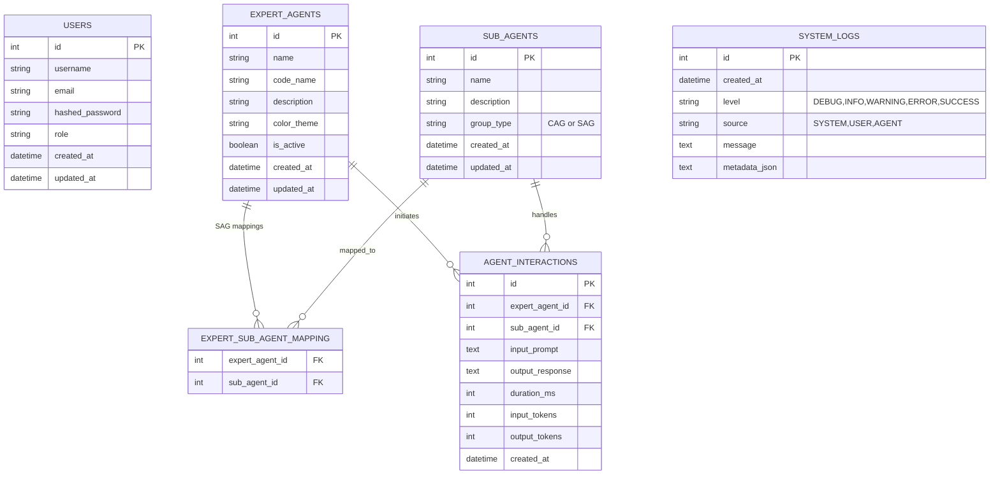

# Technical Specification: AI-Agent Application Framework (CDAGS)

**Project:** CDAGS AI-Agents: OT-IT Convergence & Cybersecurity  
**Pattern:** Mixture of Experts (MoE)  
**Status:** Iteration 1 COMPLETE — Iteration 2 (Orchestrator + Agent Engine) IN PLANNING  
**Last updated:** 2026-06-12

---

## 1. System Architecture & Design Patterns

The AI-Agent Application Framework orchestrates a set of specialized **Expert AI Agents** and **Sub-Agents** to solve complex domain-specific tasks in OT (Operational Technology) and IT convergence environments.


> **CAG vs SAG routing:** The Common Agent Group (CAG) is a shared pool — every Expert Agent can invoke any CAG sub-agent implicitly. SAG sub-agents (Modbus, Safety Compliance) are restricted to explicitly authorized Expert Agents via the `expert_sub_agent_mapping` table.

### 1.1 The Mixture of Experts (MoE) Pattern

1. **Orchestrator (Router)**: Receives requests, routes them to the correct Expert Agent, enforces CAG/SAG access rules, and maintains global system state. *(Iteration 2 target)*
2. **Expert Agents**: Domain-specific agents with deep functional knowledge of one OT domain. Each has a `code_name`, `color_theme`, and a list of authorized SAG sub-agents.
3. **Sub-Agents**: Utility agents in two groups:
   - **CAG (Common Agent Group)**: Available to all Expert Agents implicitly (`group_type = "CAG"`). Never stored in the mapping table.
   - **SAG (Specific Agent Group)**: Restricted to one or more explicitly authorized Expert Agents. Pairings stored in `expert_sub_agent_mapping`.

### 1.2 Agent Communication Protocol

- **Input payload**: JSON object — `transaction_id`, `caller_agent`, `target_agent`, `routing_group`, `payload`.
- **Output payload**: JSON object — `transaction_id`, `status`, `executing_agent`, `payload`, `errors`.
- **Interactions are persisted** in the `agent_interactions` table for auditing and analytics.
- Protocol detail: see Section 4.1.

---

## 2. Backend Technical Specification (Python & FastAPI)

**Stack:** Python 3.10+, FastAPI, SQLAlchemy 2.x, SQLite, passlib/bcrypt, python-jose JWT  
**Virtual environment:** `appsFrame/` (root-level venv)  
**Run directory:** `backend/`

### 2.1 Backend Directory Structure — Current State

```
backend/
├── app/
│   ├── __init__.py
│   ├── main.py                 # FastAPI app init, CORS, lifespan, router registration
│   ├── database.py             # SQLAlchemy engine, SessionLocal, Base, get_db()
│   ├── models/
│   │   ├── __init__.py
│   │   ├── agent.py            # ExpertAgent, SubAgent, AgentInteraction, mapping table
│   │   ├── log.py              # SystemLog model
│   │   └── user.py             # User model (username, email, hashed_password, role)
│   ├── schemas/
│   │   ├── __init__.py
│   │   ├── agent.py            # SubAgentResponse, ExpertAgentResponse, AgentSelectResponse,
│   │   │                       #   AgentInteractionResponse
│   │   ├── log.py              # SystemLogCreate, SystemLogResponse
│   │   └── user.py             # UserLogin, LoginResponse, UserCreate, UserResponse
│   └── api/
│       ├── __init__.py
│       ├── auth.py             # POST /api/auth/login — bcrypt verify + HS256 JWT
│       ├── agents.py           # GET /api/agents/, POST /api/agents/{id}/select
│       └── logs.py             # GET /api/logs/, POST /api/logs/
├── seed.py                     # DB seed — drops and recreates tables, seeds 8 Expert Agents
│                               # WARNING: currently destructive (drop_all). Non-idempotent.
├── database_test.py            # Manual DB connectivity test script
└── requirements.txt            # Python dependencies
```

> **Not yet built (Iteration 2):**
> - `app/services/` — agent engine, CAG/SAG routing logic
> - `tests/` — Pytest test suite
> - `run.py` — convenience entry point
> - `app/config.py` — centralized config/env management

### 2.2 Database Schema — Current State



**Key deviations from original SPEC:**

| Item | Original SPEC | Actual implementation |
|------|--------------|----------------------|
| `SYSTEM_LOGS.timestamp` column | `timestamp` | `created_at` |
| `SubAgent.code_name` field | present | **absent** — model has no `code_name` column |
| `ExpertAgentResponse.sag_sub_agents` | field name `sag_sub_agents` | field name `specific_sub_agents` |
| `AGENT_INTERACTIONS` table | not in original SPEC | **added** — captures expert↔sub-agent calls |
| `User.email` field | absent | **added** — `LoginResponse` returns `email` |
| `updated_at` timestamps | absent | **added** on all models |
| Auth | mock `admin`/`admin`, returns hardcoded token | Real bcrypt + HS256 JWT via `JWT_SECRET_KEY` env var |
| `LogLevel` values | `INFO,WARNING,ERROR,SUCCESS` | `DEBUG,INFO,WARNING,ERROR,SUCCESS` (DEBUG added) |

### 2.3 Pydantic Schemas — Current State

#### `schemas/agent.py`

```python
class SubAgentResponse(BaseModel):
    id: int
    name: str
    description: Optional[str]
    group_type: str               # "CAG" or "SAG"
    created_at: datetime
    updated_at: Optional[datetime]

class ExpertAgentResponse(BaseModel):
    id: int
    name: str
    description: Optional[str]
    color_theme: str
    is_active: bool
    created_at: datetime
    updated_at: Optional[datetime]
    specific_sub_agents: List[SubAgentResponse] = []   # SAG sub-agents only

class AgentSelectResponse(BaseModel):
    status: str
    message: str
    agent_id: int

class AgentInteractionResponse(BaseModel):
    id: int
    expert_agent_id: int
    sub_agent_id: int
    input_prompt: str
    output_response: Optional[str]
    duration_ms: Optional[int]
    input_tokens: Optional[int]
    output_tokens: Optional[int]
    created_at: datetime
```

#### `schemas/log.py`

```python
LogLevel = Literal["DEBUG", "INFO", "WARNING", "ERROR", "SUCCESS"]

class SystemLogCreate(BaseModel):
    level: LogLevel = "INFO"
    source: str = "SYSTEM"
    message: str
    metadata_json: Optional[str] = None

class SystemLogResponse(BaseModel):
    id: int
    created_at: datetime          # NOTE: field is created_at, not timestamp
    level: LogLevel
    source: str
    message: str
    metadata_json: Optional[str]
```

#### `schemas/user.py`

```python
class UserLogin(BaseModel):
    username: str
    password: str

class LoginResponse(BaseModel):
    status: str
    token: str
    id: int
    username: str
    email: str                    # NOTE: email is included in login response
    role: str
```

### 2.4 API Endpoints — Current State

| Method | Endpoint | Auth | Response | Description |
|--------|----------|------|----------|-------------|
| `POST` | `/api/auth/login` | None | `LoginResponse` | bcrypt verify + HS256 JWT. Credentials: `admin`/`admin` |
| `GET` | `/api/agents/` | None* | `List[ExpertAgentResponse]` | All active Expert Agents with their SAG `specific_sub_agents` |
| `POST` | `/api/agents/{id}/select` | None* | `AgentSelectResponse` | Registers selection, writes `USER` log entry |
| `GET` | `/api/logs/` | None* | `List[SystemLogResponse]` | Recent logs, newest-first. Query param: `limit` (1–500, default 50) |
| `POST` | `/api/logs/` | None* | `SystemLogResponse` | Add a manual log entry |
| `GET` | `/health` | None | `{"status": "ok"}` | Health check |

> *Auth header not yet enforced on these endpoints — JWT is issued but not validated on incoming requests. Iteration 2 target.

### 2.5 Database Seed Data

Run: `cd backend && python seed.py`

> **WARNING:** `seed.py` currently calls `Base.metadata.drop_all()` — it **destroys all existing data** on every run. It is **not idempotent**. Fix planned for Iteration 2.

#### Expert Agents (8 records)

| Name | code_name | color_theme |
|------|-----------|-------------|
| UI Color Palate Manager | `ui_color_palate_manager` | `#334155` |
| OT Plant Data Manager | `ot_plant_data_manager` | `#1e3a8a` |
| OT Plant Asset Register Manager | `ot_plant_asset_register_manager` | `#0f766e` |
| OT Plant Asset Risk Register Manager | `ot_plant_asset_risk_register_manager` | `#15803d` |
| OT Plant Change Management Manager | `ot_plant_change_management_manager` | `#991b1b` |
| OT Plant Logging & Monitoring Manager | `ot_plant_logging_monitoring_manager` | `#b45309` |
| OT Plant Security Incident Manager | `ot_plant_security_incident_manager` | `#4338ca` |
| OT Plant Analytics & Report Manager | `ot_plant_analytics_report_manager` | `#0369a1` |

#### Sub-Agents — NOT YET SEEDED

The 5 sub-agents below are defined in the SPEC but **`seed.py` does not create them**. The `expert_sub_agent_mapping` table is empty. This must be fixed before Iteration 2 work begins.

| Name | code_name | group_type | Authorized Expert Agents |
|------|-----------|------------|--------------------------|
| Email Agent | `email_agent` | `CAG` | All (implicit) |
| Alert Notification Agent | `alert_notification_agent` | `CAG` | All (implicit) |
| Trouble Ticket Agent | `trouble_ticket_agent` | `CAG` | All (implicit) |
| Modbus Protocol Agent | `modbus_protocol_agent` | `SAG` | OT Plant Data Manager |
| Safety Compliance Agent | `safety_compliance_agent` | `SAG` | OT Plant Asset Register Manager |

### 2.6 Environment Variables

Required in `backend/app/.env`:

```
DATABASE_URL=sqlite:///./cdags_framework.db
JWT_SECRET_KEY=<random 32-byte hex — generate: openssl rand -hex 32>
JWT_EXPIRE_MINUTES=60
```

---

## 3. Frontend Technical Specification (React & TypeScript)

**Stack:** React 19, TypeScript, Vite 8, Vanilla CSS  
**Dev port:** `6173` (strict — fails if occupied)  
**API proxy:** `/api/*` → `http://localhost:8000`

### 3.1 Frontend Directory Structure — Current State

```
frontend/
├── index.html                      # HTML shell, favicon → /favicon.svg
├── package.json
├── tsconfig.json                   # Root TS config — includes "types": ["vite/client"]
├── tsconfig.app.json               # Vite build TS config
├── tsconfig.node.json
├── vite.config.ts                  # Port 6173, strictPort, proxy /api → :8000
├── eslint.config.js
├── FRONTEND_ARCHITECTURE.md        # Full frontend developer reference
├── public/
│   ├── favicon.svg
│   ├── icons.svg
│   └── bg-dark-hex.jpg             # Dark hex-mesh texture (available, not active)
└── src/
    ├── main.tsx
    ├── App.tsx                     # Provider tree + AuthCheckGate + DashboardShell
    ├── vite-env.d.ts               # /// <reference types="vite/client" />
    ├── types/
    │   └── index.ts                # UserSession, SubAgent, ExpertAgent, SystemLog
    ├── context/
    │   ├── AuthContext.tsx         # Session state, login (JWT), logout
    │   ├── AgentContext.tsx        # Agent list, active selection, log polling (2s)
    │   └── ThemeContext.tsx        # Light/dark toggle, body class, localStorage
    ├── components/
    │   ├── Layout/
    │   │   ├── Banner.tsx          # Logo, title (27px), user, live clock, theme toggle
    │   │   ├── Sidebar.tsx         # Agent list, active highlight
    │   │   ├── LogPanel.tsx        # Live log console, auto-scroll, newest-at-bottom
    │   │   └── Footer.tsx          # "Powered by CDAGS © 2026"
    │   ├── Agent/
    │   │   ├── AgentGrid.tsx       # auto-fit grid of agent tiles
    │   │   └── AgentTile.tsx       # Per-agent color border + glow, active scale
    │   └── Auth/
    │       └── LoginForm.tsx       # Login card overlay
    └── styles/
        ├── variables.css           # :root tokens + body.light-theme + body.dark-theme
        ├── global.css              # Reset, imports variables/layouts/components
        ├── layouts.css             # Full-viewport CSS grid (banner/sidebar/main/logs/footer)
        └── components.css          # Component classes (.agent-tile, .sidebar-item, etc.)
```

> **Removed vs original SPEC:** `src/index.css`, `src/App.css` (scaffold), `src/themes.css` (merged into `variables.css`), empty `src/pages/`, `src/api/`, `src/store/` directories.

### 3.2 UI Design System

#### Banner
- Title: **"CDAGS AI-Agents: OT-IT Convergence & Cybersecurity"** — `27px`, `fontWeight: 800`
- "CDAGS" colored `#00f0ff` (neon blue)
- Logo badge: circular `D` in `--active-highlight` blue

#### Main Content Heading
- **"AI-Agents: OT Operational Functions"** — "AI-Agents" colored `#00f0ff` (neon blue)

#### Agent Tile Colors (seeded from DB)
1. Slate Grey `#334155` — UI Color Palate Manager
2. Navy Blue `#1e3a8a` — OT Plant Data Manager
3. Deep Teal `#0f766e` — OT Plant Asset Register Manager
4. Forest Green `#15803d` — OT Plant Asset Risk Register Manager
5. Deep Crimson `#991b1b` — OT Plant Change Management Manager
6. Dark Gold/Amber `#b45309` — OT Plant Logging & Monitoring Manager
7. Purple/Indigo `#4338ca` — OT Plant Security Incident Manager
8. Steel Blue `#0369a1` — OT Plant Analytics & Report Manager

#### CSS Grid Layout
```
rows:    70px  1fr  20vh  30px
columns: 280px 1fr
areas:   "banner banner" / "sidebar main" / "logs logs" / "footer footer"
```

### 3.3 Known Frontend Gaps (Iteration 2 Targets)

| # | Gap |
|---|-----|
| 1 | JWT token stored in `localStorage` but never sent as `Authorization: Bearer` header |
| 2 | No React error boundary — unhandled errors crash the full app |
| 3 | Log polling runs unconditionally — should pause when tab is backgrounded |
| 4 | No frontend test suite |

---

## 4. Integration & Protocol Definition

### 4.1 Agent-to-Agent JSON Protocol

Expert agents invoke sub-agents via structured JSON. All interactions are persisted in `agent_interactions`.

#### Request Payload
```json
{
  "transaction_id": "tx_8f8e02d8-2615-46b0-bbcb",
  "timestamp": "2026-06-09T10:31:52Z",
  "caller_agent": "ot_plant_data_manager",
  "target_agent": "email_agent",
  "routing_group": "CAG",
  "payload": {
    "recipients": ["safety-lead@plant.cdags.com"],
    "subject": "Warning: Asset Temperature Exceeded",
    "body": "OT Plant Asset id-1082 (Generator Core) registered 98.4C, exceeding 90C threshold.",
    "severity": "CRITICAL"
  }
}
```

#### Response Payload
```json
{
  "transaction_id": "tx_8f8e02d8-2615-46b0-bbcb",
  "timestamp": "2026-06-09T10:31:53Z",
  "status": "SUCCESS",
  "executing_agent": "email_agent",
  "payload": {
    "message_id": "msg_90847291",
    "delivered": true,
    "relay_latency_ms": 142
  },
  "errors": null
}
```

### 4.2 Logging Protocol

All agent actions, user interactions, and system events are written to `system_logs` via `POST /api/logs/`.

| Source | Used for |
|--------|----------|
| `USER` | UI clicks, tile selections, manual inputs |
| `SYSTEM` | Startup, DB operations, theme changes |
| `AGENT` | Expert→sub-agent calls, completions, routing errors |

---

## 5. Iteration Status

### Iteration 1 — COMPLETE ✓

| Task | Status |
|------|--------|
| SQLite models (User, ExpertAgent, SubAgent, AgentInteraction, SystemLog) | ✓ Done |
| FastAPI app with CORS, lifespan DB init | ✓ Done |
| Auth endpoint — real bcrypt + JWT | ✓ Done |
| Agent list + select endpoints | ✓ Done |
| Log create + fetch endpoints | ✓ Done |
| React SPA — full layout (Banner/Sidebar/Grid/LogPanel/Footer) | ✓ Done |
| Light/Dark theme system | ✓ Done |
| Live log console with 2s polling and auto-scroll | ✓ Done |
| Agent tile per-color border and glow | ✓ Done |
| TypeScript — zero `tsc --noEmit` errors | ✓ Done |

### Iteration 1 — Remaining Deficiencies (fix before or during Iteration 2)

| # | Issue | Priority |
|---|-------|----------|
| 1 | `seed.py` is destructive (`drop_all`) and not idempotent | High |
| 2 | Sub-agents (5 records) not seeded; mapping table empty | High |
| 3 | `SubAgent` model missing `code_name` column | High |
| 4 | JWT not validated on `GET /api/agents/` and `GET /api/logs/` | Medium |
| 5 | Frontend does not send `Authorization` header | Medium |
| 6 | No Pytest test suite | Medium |

### Iteration 2 — PLANNED (Next)

Target: implement the MoE execution layer.

| Component | Description |
|-----------|-------------|
| `app/services/agent_engine.py` | `get_available_sub_agents(expert_agent)` — unions CAG pool + agent's SAG entries. `dispatch(caller, target, payload)` — routes call, validates authorization, persists to `agent_interactions`, returns structured response |
| `app/api/orchestrator.py` | `POST /api/orchestrate` — accepts a task request, selects the correct Expert Agent, dispatches via agent engine |
| `app/services/orchestrator.py` | Routing logic — scores/selects Expert Agent based on request domain |
| Seed fix | Make `seed.py` idempotent; add 5 sub-agents and SAG mappings |
| Auth middleware | JWT validation dependency on protected endpoints |
| Frontend auth header | Attach `Authorization: Bearer <token>` on all API calls |
| Test suite | `backend/tests/` — Pytest coverage for all endpoints and engine logic |


# Iteration 2 -- Phase 1: Admin App Frontend

✻ Brewed for 8s

❯ lets wait on Track 2 and consider planning to add few critical functions in the "admin" app later on we will have non-admin app for users whose access will be based on roles or RBAC principles. Also a very,     
  very key function I want to add is for each EA to recieve and email via an interface or email gateway (opensource alternative?) and to send an email response with a tiny URL like reference to the user and/or    
  make the tine uRL available in the user's window which is available in next login by the user.                                                                                                                     

⏺ These are significant architectural decisions worth thinking through carefully before planning. Let me make sure I understand the scope:
  ⎿  Interrupted · What should Claude do instead?

❯ first tell me if the above is good design thinking approach or you have better alternative design. I will then write a detailed description like a SPEC.md extension so you can use that to build your plan.       

⏺ Good instincts overall — here's my honest assessment of each piece:

  Role-based user app (non-admin) — solid
  Separating admin from user-facing app by role is standard practice. Your /#admin hash approach extends naturally — /#app for the user shell, gated by role from the JWT payload. The User model already has a role
  field, so RBAC enforcement is already partially in place. Good foundation.

  Email-in / Email-out per Expert Agent — this is the most architecturally significant piece

  Your instinct to use an open-source email gateway is right. The two strongest options:

  - Postal — full self-hosted MTA, API-driven, handles inbound + outbound, webhooks on receive. Production-grade but heavier to run.
  - Mailpit (dev) / Stalwart (prod) — lighter alternatives. Stalwart is a modern all-in-one mail server with a REST API.

  For your use case (each EA has its own inbound address like ot-plant-data@cdags.local, receives email, dispatches to the agent engine, replies), Postal or Stalwart are the best fits. Both expose webhooks on
  inbound mail — clean integration with FastAPI.

  Tiny URL / persistent result reference — good idea, one design question

  The concept is sound: agent processes email → generates a response → creates a short reference link → stores it → user sees it on next login. The question is whether the tiny URL points to:

  1. A result stored inside your own DB (a new AgentResult table, short UUID key) — simpler, self-contained, no external dependency
  2. An external URL shortener — unnecessary complexity for an internal system

  Option 1 is clearly better here. A GET /r/{short_id} endpoint returns the stored result. The short ID is a 8-char UUID fragment. No external service needed.

  My one architectural suggestion:

  Before you write the SPEC extension, consider naming the email-to-agent flow explicitly as the "Email Sub-Agent" — because it maps directly onto the Email Agent (CAG sub-agent) already defined in your
  architecture. Inbound email triggers the orchestrator → selects the Expert Agent → processes → Email Agent sends reply with the result link. This keeps it fully within the MoE pattern you already designed.

---
  Go ahead and write the SPEC extension — with that framing in mind, I'll be able to build a precise plan from it.

✻ Baked for 17s

※ recap: Building a CDAGS AI-Agent framework with a React frontend and FastAPI backend. Track 1 fixes are done and the admin app is live. Next: user writes a SPEC extension describing the email gateway and 
  role-based user app before we plan Track 2.
